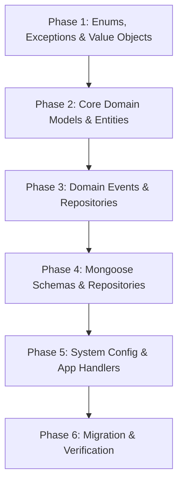

# Phase-by-Phase Package Domain Refactor Plan

This document breaks down the refactor plan defined in [package.md](file:///home/gnourt/data/hcmus/competition/start-up/HiveK/apps/server/docs/refactor/package.md) into 6 distinct, sequential implementation phases. Each phase is designed to be atomic, testable, and step-by-step.

---

## Refactoring Overview Map



---

## Phase 1: Enums, Exceptions & Value Objects

In this phase, we establish the foundational types and validation constraints. This does not touch any database code or business logic handlers, making it completely safe to build first.

### 1. Enums
Create the following enums:
*   [EGrantType](file:///home/gnourt/data/hcmus/competition/start-up/HiveK/apps/server/src/core/enums/grant-type.enum.ts):
    ```typescript
    export enum EGrantType {
      QUOTA_HARD = 'quota_hard',
      QUOTA_RENEWABLE = 'quota_renewable',
      CREDIT_TOP_UP = 'credit_top_up',
      PERMISSION = 'permission',
    }
    ```
*   [EBillLineType](file:///home/gnourt/data/hcmus/competition/start-up/HiveK/apps/server/src/core/enums/bill-line-type.enum.ts):
    ```typescript
    export enum EBillLineType {
      PLAN_PURCHASE = 'plan_purchase',
      ADDON_PURCHASE = 'addon_purchase',
      CREDIT_TOP_UP = 'credit_top_up',
    }
    ```
*   [ECreditTransactionType](file:///home/gnourt/data/hcmus/competition/start-up/HiveK/apps/server/src/core/enums/credit-transaction-type.enum.ts):
    ```typescript
    export enum ECreditTransactionType {
      TOP_UP = 'top_up',
      DEDUCTION = 'deduction',
    }
    ```
*   Update [index.ts](file:///home/gnourt/data/hcmus/competition/start-up/HiveK/apps/server/src/core/enums/index.ts) to export all three.

### 2. Exceptions
Create the following custom domain exceptions:
*   [InsufficientCreditException](file:///home/gnourt/data/hcmus/competition/start-up/HiveK/apps/server/src/core/exceptions/credit.exception.ts):
    ```typescript
    import { DomainException } from '../common';
    export class InsufficientCreditException extends DomainException {
      constructor(enterpriseId: string, creditType: string, required: number, available: number) {
        super(`Enterprise ${enterpriseId} has insufficient ${creditType} credit. Required: ${required}, Available: ${available}`);
      }
    }
    ```
*   [QuotaExceededException](file:///home/gnourt/data/hcmus/competition/start-up/HiveK/apps/server/src/core/exceptions/quota.exception.ts):
    ```typescript
    import { DomainException } from '../common';
    export class QuotaExceededException extends DomainException {
      constructor(enterpriseId: string, quotaKey: string) {
        super(`Enterprise ${enterpriseId} has exceeded renewable quota limit for key: ${quotaKey}`);
      }
    }
    ```
*   Update [index.ts](file:///home/gnourt/data/hcmus/competition/start-up/HiveK/apps/server/src/core/exceptions/index.ts) to export both.

### 3. Value Objects
Create/Modify the following value objects under `src/core/value-objects`:
*   **Create** [GrantVO](file:///home/gnourt/data/hcmus/competition/start-up/HiveK/apps/server/src/core/value-objects/grant.vo.ts):
    ```typescript
    import { BaseValueObject } from '../common';
    import { EGrantType } from '../enums';

    export interface GrantProps {
      type: EGrantType;
      key: string;
      value: number;
      resetCycle?: 'monthly' | 'weekly' | 'daily';
      creditFallback?: {
        creditType: string;
        creditsPerUnit: number;
      } | null;
    }

    export class GrantVO extends BaseValueObject<GrantProps> {
      constructor(props: GrantProps) {
        super(props);
      }
      get type(): EGrantType { return this.props.type; }
      get key(): string { return this.props.key; }
      get value(): number { return this.props.value; }
      get resetCycle(): 'monthly' | 'weekly' | 'daily' | undefined { return this.props.resetCycle; }
      get creditFallback(): GrantProps['creditFallback'] { return this.props.creditFallback; }
    }
    ```
*   **Create** [PlanItemVO](file:///home/gnourt/data/hcmus/competition/start-up/HiveK/apps/server/src/core/value-objects/plan-item.vo.ts) (replaces old `SubscriptionItemVO` for plans):
    ```typescript
    import { BaseValueObject } from '../common';

    export interface PlanItemProps {
      packageId: string;
      packageVariantId: string;
      startDate: Date;
      expiresAt: Date;
      billId: string;
      autoRenew: boolean;
    }

    export class PlanItemVO extends BaseValueObject<PlanItemProps> {
      constructor(props: PlanItemProps) {
        super(props);
      }
      get packageId(): string { return this.props.packageId; }
      get packageVariantId(): string { return this.props.packageVariantId; }
      get startDate(): Date { return this.props.startDate; }
      get expiresAt(): Date { return this.props.expiresAt; }
      get billId(): string { return this.props.billId; }
      get autoRenew(): boolean { return this.props.autoRenew; }

      isExpired(): boolean {
        return new Date() > this.props.expiresAt;
      }
    }
    ```
*   **Create** [AddonItemVO](file:///home/gnourt/data/hcmus/competition/start-up/HiveK/apps/server/src/core/value-objects/addon-item.vo.ts) (replaces old `SubscriptionItemVO` for add-ons):
    ```typescript
    import { BaseValueObject } from '../common';

    export interface AddonItemProps {
      packageId: string;
      packageVariantId: string;
      purchasedAt: Date;
      expiresAt: Date | null;
      billId: string;
    }

    export class AddonItemVO extends BaseValueObject<AddonItemProps> {
      constructor(props: AddonItemProps) {
        super(props);
      }
      get packageId(): string { return this.props.packageId; }
      get packageVariantId(): string { return this.props.packageVariantId; }
      get purchasedAt(): Date { return this.props.purchasedAt; }
      get expiresAt(): Date | null { return this.props.expiresAt; }
      get billId(): string { return this.props.billId; }

      isExpired(): boolean {
        if (this.props.expiresAt === null) return false;
        return new Date() > this.props.expiresAt;
      }
    }
    ```
*   **Create** [CreditBalanceVO](file:///home/gnourt/data/hcmus/competition/start-up/HiveK/apps/server/src/core/value-objects/credit-balance.vo.ts):
    ```typescript
    import { BaseValueObject } from '../common';

    export interface CreditBalanceProps {
      creditType: string;
      total: number;
      used: number;
    }

    export class CreditBalanceVO extends BaseValueObject<CreditBalanceProps> {
      constructor(props: CreditBalanceProps) {
        super(props);
      }
      get creditType(): string { return this.props.creditType; }
      get total(): number { return this.props.total; }
      get used(): number { return this.props.used; }
      get available(): number { return this.props.total - this.props.used; }
    }
    ```
*   **Create** [RenewableUsageVO](file:///home/gnourt/data/hcmus/competition/start-up/HiveK/apps/server/src/core/value-objects/renewable-usage.vo.ts):
    ```typescript
    import { BaseValueObject } from '../common';

    export interface RenewableUsageProps {
      key: string;
      allocated: number;
      used: number;
      cycleStartAt: Date;
      cycleEndsAt: Date;
    }

    export class RenewableUsageVO extends BaseValueObject<RenewableUsageProps> {
      constructor(props: RenewableUsageProps) {
        super(props);
      }
      get key(): string { return this.props.key; }
      get allocated(): number { return this.props.allocated; }
      get used(): number { return this.props.used; }
      get cycleStartAt(): Date { return this.props.cycleStartAt; }
      get cycleEndsAt(): Date { return this.props.cycleEndsAt; }
    }
    ```
*   **Remove** the obsolete `quota.vo.ts` and `package-feature.vo.ts` from `src/core/value-objects`.
*   **Modify** [bill-item.vo.ts](file:///home/gnourt/data/hcmus/competition/start-up/HiveK/apps/server/src/core/value-objects/bill-item.vo.ts) to match the new bill lines layout:
    ```typescript
    import { BaseValueObject } from '../common';
    import { EBillLineType, EPurchaseType } from '../enums';

    export interface BillItemProps {
      lineType: EBillLineType;
      packageId: string | null;
      packageVariantId: string | null;
      creditType: string | null;
      creditAmount: number | null;
      price: number;
      taxPercent: number;
      purchaseType: EPurchaseType;
    }

    export class BillItemVO extends BaseValueObject<BillItemProps> {
      constructor(props: BillItemProps) {
        super(props);
      }
      get lineType(): EBillLineType { return this.props.lineType; }
      get packageId(): string | null { return this.props.packageId; }
      get packageVariantId(): string | null { return this.props.packageVariantId; }
      get creditType(): string | null { return this.props.creditType; }
      get creditAmount(): number | null { return this.props.creditAmount; }
      get price(): number { return this.props.price; }
      get taxPercent(): number { return this.props.taxPercent; }
      get purchaseType(): EPurchaseType { return this.props.purchaseType; }
    }
    ```
*   **Modify** [subscription-change-details.vo.ts](file:///home/gnourt/data/hcmus/competition/start-up/HiveK/apps/server/src/core/value-objects/subscription-change-details.vo.ts) to diff the new `GrantVO` objects instead of `QuotaVO`:
    ```typescript
    import { BaseValueObject } from '../common';
    import { GrantVO } from './grant.vo';

    export interface SubscriptionChangeDetailsProps {
      oldPlanId: string | null;
      newPlanId: string | null;
      addedAddonIds: string[];
      removedAddonIds: string[];
      oldGrants: GrantVO[];
      newGrants: GrantVO[];
      oldPermissions: string[];
      newPermissions: string[];
    }

    export class SubscriptionChangeDetailsVO extends BaseValueObject<SubscriptionChangeDetailsProps> {
      constructor(props: SubscriptionChangeDetailsProps) {
        super(props);
      }
      get oldPlanId(): string | null { return this.props.oldPlanId; }
      get newPlanId(): string | null { return this.props.newPlanId; }
      get addedAddonIds(): string[] { return this.props.addedAddonIds; }
      get removedAddonIds(): string[] { return this.props.removedAddonIds; }
      get oldGrants(): GrantVO[] { return this.props.oldGrants; }
      get newGrants(): GrantVO[] { return this.props.newGrants; }
      get oldPermissions(): string[] { return this.props.oldPermissions; }
      get newPermissions(): string[] { return this.props.newPermissions; }
    }
    ```
*   Update [index.ts](file:///home/gnourt/data/hcmus/competition/start-up/HiveK/apps/server/src/core/value-objects/index.ts) to export all new VOs and remove obsolete ones.

---

## Phase 2: Core Domain Model Refactoring (Aggregates & Entities)

In this phase, we update existing aggregate roots/entities and create the new aggregates.

### 1. `PackageVariantEntity`
Modify [package-variant.entity.ts](file:///home/gnourt/data/hcmus/competition/start-up/HiveK/apps/server/src/core/entities/package-variant.entity.ts):
*   Replace `extraQuotas: QuotaVO` with `extraGrants: GrantVO[]` in properties.
*   Make `durationMonths` nullable (`number | null`).

### 2. `PackageRoot`
Modify [package.aggregate.ts](file:///home/gnourt/data/hcmus/competition/start-up/HiveK/apps/server/src/core/aggregate-roots/package.aggregate.ts):
*   Replace `features: PackageFeatureVO[]` with `features: string[]`.
*   Remove `baseQuotas: QuotaVO`.
*   Add `baseGrants: GrantVO[]` to properties.
*   Update creation, instantiating, and general information updates.

### 3. `SubscriptionRoot`
Modify [subscription.aggregate.ts](file:///home/gnourt/data/hcmus/competition/start-up/HiveK/apps/server/src/core/aggregate-roots/subscription.aggregate.ts):
*   Change `items: SubscriptionItemVO[]` to `planItem: PlanItemVO | null` and `addonItems: AddonItemVO[]`.
*   Replace `computedQuotas: QuotaVO` with `computedGrants: GrantVO[]`.
*   Implement private `recomputeGrants()` logic:
    ```typescript
    private recomputeGrants(): void {
      const grantsMap = new Map<string, GrantVO>();
      const permissionsSet = new Set<string>();

      const processGrants = (grants: GrantVO[], isPlan: boolean) => {
        for (const grant of grants) {
          if (grant.type === EGrantType.PERMISSION) {
            permissionsSet.add(grant.key);
          } else if (grant.type === EGrantType.QUOTA_HARD || grant.type === EGrantType.QUOTA_RENEWABLE) {
            const existing = grantsMap.get(grant.key);
            if (existing) {
              const newValue = existing.value + grant.value;
              // Preserve the plan's fallback if stack merges, otherwise default
              const fallback = isPlan ? (grant.creditFallback ?? existing.creditFallback) : (existing.creditFallback ?? grant.creditFallback);
              grantsMap.set(grant.key, new GrantVO({
                ...existing.unmarshal,
                value: newValue,
                creditFallback: fallback
              }));
            } else {
              grantsMap.set(grant.key, grant);
            }
          }
        }
      };

      // 1. Process Plan Grants
      // (Caller must load and supply plan and addon packages details)
    }
    ```
    *(Note: Since `SubscriptionRoot` does not load repository data itself, the merge algorithm needs the active plans' and addons' base + extra grants as arguments to this function, e.g., `recomputeGrants(planGrants: GrantVO[], addonsGrants: Map<string, GrantVO[]>)`).*

### 4. Create `CreditWalletRoot`
Create [credit-wallet.aggregate.ts](file:///home/gnourt/data/hcmus/competition/start-up/HiveK/apps/server/src/core/aggregate-roots/credit-wallet.aggregate.ts):
```typescript
import { BaseAggregateRoot } from '../common';
import { CreditBalanceVO } from '../value-objects';
import { InsufficientCreditException } from '../exceptions';

export interface CreditWalletProps {
  enterpriseId: string;
  balances: CreditBalanceVO[];
  createdAt: Date;
  updatedAt: Date;
}

export class CreditWalletRoot extends BaseAggregateRoot<CreditWalletProps> {
  static create(enterpriseId: string): CreditWalletRoot {
    const now = new Date();
    return new CreditWalletRoot({
      enterpriseId,
      balances: [],
      createdAt: now,
      updatedAt: now,
    });
  }

  static instantiate(id: string, props: CreditWalletProps): CreditWalletRoot {
    return new CreditWalletRoot(props, id);
  }

  get enterpriseId(): string { return this.props.enterpriseId; }
  get balances(): CreditBalanceVO[] { return this.props.balances; }

  getAvailable(creditType: string): number {
    const bal = this.props.balances.find(b => b.creditType === creditType);
    return bal ? bal.available : 0;
  }

  topUp(creditType: string, amount: number, reason: string): void {
    if (amount <= 0) return;
    const index = this.props.balances.findIndex(b => b.creditType === creditType);
    const now = new Date();

    if (index !== -1) {
      const existing = this.props.balances[index];
      this.props.balances[index] = new CreditBalanceVO({
        creditType,
        total: existing.total + amount,
        used: existing.used,
      });
    } else {
      this.props.balances.push(new CreditBalanceVO({
        creditType,
        total: amount,
        used: 0,
      }));
    }
    this.props.updatedAt = now;
    // Emits Event later
  }

  deduct(creditType: string, amount: number, reason: string): void {
    if (amount <= 0) return;
    const index = this.props.balances.findIndex(b => b.creditType === creditType);
    const available = index !== -1 ? this.props.balances[index].available : 0;

    if (available < amount) {
      throw new InsufficientCreditException(this.enterpriseId, creditType, amount, available);
    }

    const existing = this.props.balances[index];
    this.props.balances[index] = new CreditBalanceVO({
      creditType,
      total: existing.total,
      used: existing.used + amount,
    });
    this.props.updatedAt = new Date();
  }
}
```

### 5. Create `QuotaUsageRoot`
Create [quota-usage.aggregate.ts](file:///home/gnourt/data/hcmus/competition/start-up/HiveK/apps/server/src/core/aggregate-roots/quota-usage.aggregate.ts):
```typescript
import { BaseAggregateRoot } from '../common';
import { RenewableUsageVO } from '../value-objects';

export interface QuotaUsageProps {
  enterpriseId: string;
  cycleAnchorDate: Date;
  usages: RenewableUsageVO[];
  updatedAt: Date;
}

export class QuotaUsageRoot extends BaseAggregateRoot<QuotaUsageProps> {
  static create(enterpriseId: string, cycleAnchorDate: Date): QuotaUsageRoot {
    const now = new Date();
    return new QuotaUsageRoot({
      enterpriseId,
      cycleAnchorDate,
      usages: [],
      updatedAt: now,
    });
  }

  static instantiate(id: string, props: QuotaUsageProps): QuotaUsageRoot {
    return new QuotaUsageRoot(props, id);
  }

  get enterpriseId(): string { return this.props.enterpriseId; }
  get cycleAnchorDate(): Date { return this.props.cycleAnchorDate; }
  get usages(): RenewableUsageVO[] { return this.props.usages; }

  tryConsume(key: string, amount: number): { ok: boolean; overflow: number } {
    const index = this.props.usages.findIndex(u => u.key === key);
    if (index === -1) {
      return { ok: false, overflow: amount };
    }
    const usage = this.props.usages[index];
    const newUsed = usage.used + amount;

    if (newUsed <= usage.allocated) {
      this.props.usages[index] = new RenewableUsageVO({
        ...usage.unmarshal,
        used: newUsed,
      });
      this.props.updatedAt = new Date();
      return { ok: true, overflow: 0 };
    } else {
      const overflow = newUsed - usage.allocated;
      return { ok: false, overflow };
    }
  }

  recompute(renewableGrants: { key: string; value: number; resetCycle: 'monthly' | 'weekly' | 'daily' }[], newAnchorDate?: Date) {
    if (newAnchorDate) {
      this.props.cycleAnchorDate = newAnchorDate;
    }
    const now = new Date();
    const updatedUsages: RenewableUsageVO[] = [];

    for (const grant of renewableGrants) {
      const existing = this.props.usages.find(u => u.key === grant.key);
      const cycleDates = this.calculateCycleDates(this.props.cycleAnchorDate, grant.resetCycle, now);

      if (existing) {
        updatedUsages.push(new RenewableUsageVO({
          key: grant.key,
          allocated: grant.value,
          used: existing.used, // Preserve used (can result in hard-lock if used > allocated)
          cycleStartAt: cycleDates.start,
          cycleEndsAt: cycleDates.end,
        }));
      } else {
        updatedUsages.push(new RenewableUsageVO({
          key: grant.key,
          allocated: grant.value,
          used: 0,
          cycleStartAt: cycleDates.start,
          cycleEndsAt: cycleDates.end,
        }));
      }
    }

    this.props.usages = updatedUsages;
    this.props.updatedAt = now;
  }

  resetExpiredCycles(now: Date): string[] {
    const resetKeys: string[] = [];
    for (let i = 0; i < this.props.usages.length; i++) {
      const u = this.props.usages[i];
      if (u.cycleEndsAt <= now) {
        const nextCycle = this.calculateCycleDates(u.cycleEndsAt, 'monthly', now); // default to monthly
        this.props.usages[i] = new RenewableUsageVO({
          key: u.key,
          allocated: u.allocated,
          used: 0,
          cycleStartAt: u.cycleEndsAt,
          cycleEndsAt: nextCycle.end,
        });
        resetKeys.push(u.key);
      }
    }
    if (resetKeys.length > 0) {
      this.props.updatedAt = now;
    }
    return resetKeys;
  }

  private calculateCycleDates(anchor: Date, cycle: 'monthly' | 'weekly' | 'daily', now: Date): { start: Date; end: Date } {
    let start = new Date(anchor);
    while (true) {
      let next = new Date(start);
      if (cycle === 'monthly') next.setMonth(next.getMonth() + 1);
      else if (cycle === 'weekly') next.setDate(next.getDate() + 7);
      else next.setDate(next.getDate() + 1);

      if (next > now) {
        return { start, end: next };
      }
      start = next;
    }
  }
}
```

---

## Phase 3: Domain Events & Repository Interfaces

Define events and create repository interfaces.

### 1. Domain Events
Create files under `src/core/events`:
*   `subscription-updated.domain-event.ts` (Update props: Plan & Addon details)
*   `credit-topped-up.domain-event.ts` (Dumps enterpriseId, creditType, amount, newBalance)
*   `credit-deducted.domain-event.ts` (Dumps enterpriseId, creditType, amount, newBalance)
*   `quota-consumed.domain-event.ts` (Dumps enterpriseId, key, consumedAmount)
*   `quota-usage-reset.domain-event.ts` (Dumps enterpriseId, list of reset keys)
*   Update exports in [src/core/events/index.ts](file:///home/gnourt/data/hcmus/competition/start-up/HiveK/apps/server/src/core/events/index.ts).

### 2. Repository Interfaces
Create repository interfaces under `src/core/interfaces/repositories`:
*   **Create** [credit-wallet.repository.ts](file:///home/gnourt/data/hcmus/competition/start-up/HiveK/apps/server/src/core/interfaces/repositories/credit-wallet.repository.ts):
    ```typescript
    import { CreditWalletRoot } from '../../aggregate-roots';
    import { Nullable } from '../../types';

    export interface ICreditWalletRepository {
      findById(id: string): Promise<Nullable<CreditWalletRoot>>;
      findByEnterpriseId(enterpriseId: string): Promise<Nullable<CreditWalletRoot>>;
      save(wallet: CreditWalletRoot): Promise<void>;
    }
    ```
*   **Create** [quota-usage.repository.ts](file:///home/gnourt/data/hcmus/competition/start-up/HiveK/apps/server/src/core/interfaces/repositories/quota-usage.repository.ts):
    ```typescript
    import { QuotaUsageRoot } from '../../aggregate-roots';
    import { Nullable } from '../../types';

    export interface IQuotaUsageRepository {
      findById(id: string): Promise<Nullable<QuotaUsageRoot>>;
      findByEnterpriseId(enterpriseId: string): Promise<Nullable<QuotaUsageRoot>>;
      save(quotaUsage: QuotaUsageRoot): Promise<void>;
      findExpiredUsages(now: Date): Promise<QuotaUsageRoot[]>;
    }
    ```
*   Update exports in [src/core/interfaces/repositories/index.ts](file:///home/gnourt/data/hcmus/competition/start-up/HiveK/apps/server/src/core/interfaces/repositories/index.ts).

---

## Phase 4: Database Infrastructure & Persistence

Update existing schemas and map to database documents.

### 1. Update Existing Mongoose Schemas (`src/infrastructure/mongo/schemas`)
*   `package.schema.ts`:
    *   Change `features: PackageFeatureSchema[]` to `features: string[]`.
    *   Remove `base_quotas`.
    *   Add `base_grants` schema array matching `GrantProps`.
    *   Update `PackageVariantSchema` to use `extra_grants` instead of `extra_quotas`, and make `duration_months` nullable.
*   `subscription.schema.ts`:
    *   Change properties to support `plan_item` (`PlanItemProps`) and `addon_items` (`AddonItemProps[]`).
    *   Replace `computed_quotas` with `computed_grants`.
*   `bill.schema.ts`:
    *   Update `BillItemSchema` columns to include `lineType`, `creditType`, `creditAmount` matching the updated domain `BillItemVO`.

### 2. Create Mongoose Schemas for New Entities
*   **Create** `credit-wallet.schema.ts`:
    *   Fields: `enterprise_id: string`, `balances: [{ credit_type: string, total: number, used: number }]`.
*   **Create** `quota-usage.schema.ts`:
    *   Fields: `enterprise_id: string`, `cycle_anchor_date: Date`, `usages: [{ key: string, allocated: number, used: number, cycle_start_at: Date, cycle_ends_at: Date }]`.
*   Export both in `src/infrastructure/mongo/schemas/index.ts`.

### 3. Update Existing Repository Implementations (`src/infrastructure/mongo/repositories`)
*   `mongo-package.repository.ts`: Update domain mappers to extract `baseGrants` / `extraGrants` and skip obsolete variables.
*   `mongo-subscription.repository.ts`: Map `planItem` and `addonItems` to database schemas, and map the `computedGrants` list array.

### 4. Create New Repository Implementations
*   **Create** `mongo-credit-wallet.repository.ts` implementing `ICreditWalletRepository`.
*   **Create** `mongo-quota-usage.repository.ts` implementing `IQuotaUsageRepository` (implementing `findExpiredUsages` with queries mapping to Mongoose: `usages.cycle_ends_at: { $lte: now }`).
*   Register both inside `MongoModule` (`src/infrastructure/mongo/mongo.module.ts`).

---

## Phase 5: System Configuration & Application Layer Handlers

Implement core logic configurations and application workflows.

### 1. Create Credit Cost Configuration
*   **Create** [resource-credit-rate.config.ts](file:///home/gnourt/data/hcmus/competition/start-up/HiveK/apps/server/src/infrastructure/config/resource-credit-rate.config.ts):
    ```typescript
    export interface ResourceCreditRate {
      creditType: string;
      creditsPerUnit: number;
    }

    export const RESOURCE_CREDIT_RATES: Record<string, ResourceCreditRate> = {
      'ai_gen_video': { creditType: 'ai_credits', creditsPerUnit: 50 },
      'ai_gen_image': { creditType: 'ai_credits', creditsPerUnit: 10 },
      'ai_gen_post':  { creditType: 'ai_credits', creditsPerUnit: 5  },
    };
    ```

### 2. Update Payment Handler & Activation Workflows
*   Update subscription purchase workflows to attach `planItem` or `addonItems` depending on variant.
*   Make sure `SubscriptionRoot.recomputeGrants()` is invoked, saving the changes.
*   If `effectiveGrants` of the purchase contain `CREDIT_TOP_UP` key(s), retrieve the enterprise's `CreditWalletRoot` and call `topUp()` for each credit top-up.

### 3. Subscription Updated Event Handler
*   Listen to `SubscriptionUpdatedEvent`.
*   Inside handler, query `QuotaUsageRoot` for the enterprise.
*   If no `QuotaUsageRoot` exists, create it using `QuotaUsageRoot.create(enterpriseId, cycleAnchorDate)`.
*   Extract renewable grants from subscription `computedGrants`.
*   Call `QuotaUsageRoot.recompute(renewableGrants, newAnchorDate)` and save to repository.

### 4. Scheduler / Cron Jobs
*   **Billing Cycle Reset Cron**:
    *   Runs daily/hourly.
    *   Queries `QuotaUsageRepository.findExpiredUsages(now)`.
    *   For each entity, call `resetExpiredCycles(now)` and save.
*   **Subscription Expiry Cron**:
    *   Checks for subscriptions whose plan expires today.
    *   If `autoRenew` is false, calls `expirePlan()`, recomputes, and updates the database.

---

## Phase 6: Migration & Verification

Migrate data and confirm stability.

### 1. Data Migration Script
*   Write a simple database migration command/script (`src/infrastructure/mongo/seeding/migrate-packages.ts` or database migration tool):
    *   Transform existing public/private plans: Map old `baseQuotas` structure into `baseGrants` arrays using `QUOTA_HARD` / `QUOTA_RENEWABLE` types.
    *   Migrate active subscriptions to populate `planItem` (assuming active subscription maps to a plan).
    *   Set up default empty `CreditWalletRoot` and initial `QuotaUsageRoot` records for all active enterprises.

### 2. Verification Steps
*   Ensure compilation is complete (`npm run build`).
*   Verify DI module setup matches NestJS configuration.
*   Confirm that old tests compile (if they fail because of type mismatches, adjust mock definitions to match the new `GrantVO` structures).
