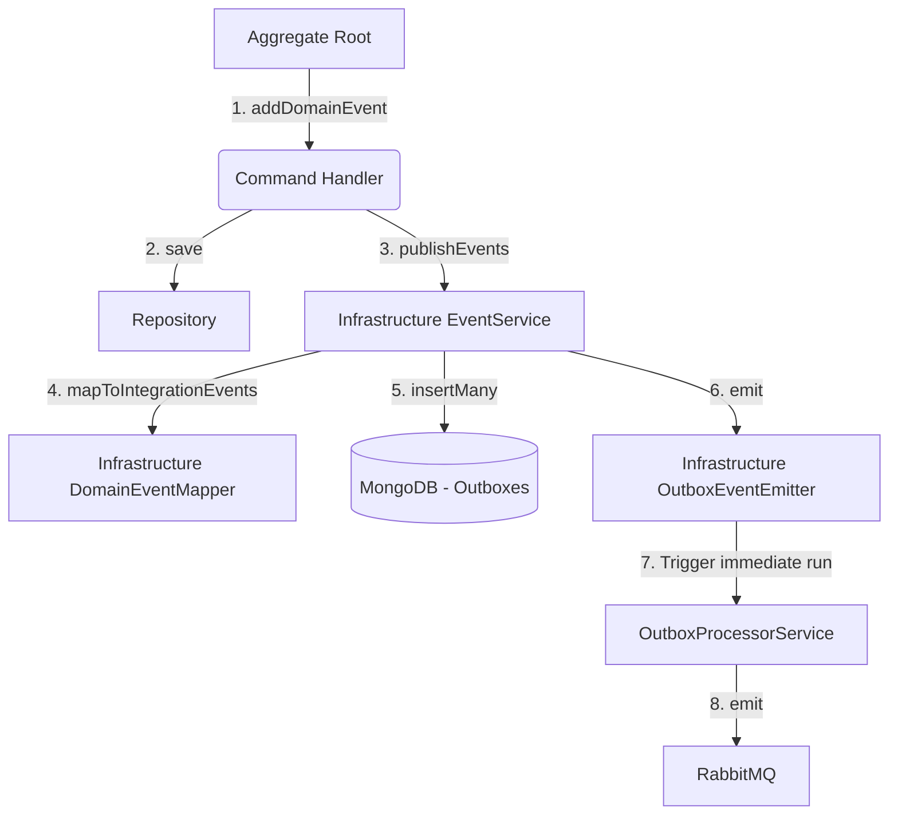

# Event & Outbox Architecture

This document describes the refactored design and implementation of the Event mapping and Outbox persistency architecture. The goal of this design is to isolate outbox concerns entirely inside the Infrastructure layer, keeping the Core (Domain) and Application layers completely clean of persistence concepts.

---

## 1. System Architecture



### Components and Responsibilities:

1. **Aggregate Root (`BaseAggregateRoot`)**: Domain entity that encapsulates business logic and accumulates internal domain events (`domainEvents`).
2. **Command Handler**: Application-level orchestrator. Resolves domain commands, calls repository `.save()`, and executes `publishEvents(aggregate)` on the injected event service.
3. **Event Service (`IEventService` / `EventService`)**: Infrastructure implementation that:
   - Extracts and clears domain events from the aggregate root.
   - Delegates mapping of domain events to integration events via `IDomainEventMapper`.
   - Converts integration events into Mongoose schema records (`OutboxModel`).
   - Persists the records in MongoDB, automatically participating in any active transaction session managed via AsyncLocalStorage (ALS).
   - Triggers the event emitter to process the records.
4. **Domain Event Mapper (`IDomainEventMapper` / `DomainEventMapper`)**: Infrastructure provider mapping domain events to integration events.
5. **Outbox Event Emitter (`OutboxEventEmitter`)**: Uses NestJS `EventEmitter2` to notify that new outbox events are ready for delivery.
6. **Outbox Processor Service (`OutboxProcessorService`)**: Listens to the `'outbox.new'` event (push-based immediate delivery) and runs a cron job every 10 seconds (pull-based polling safety net) to dispatch events asynchronously to RabbitMQ.

---

## 2. Code Definitions

### 2.1 Event Service Interface (Application Layer)

Defined at [event-service.interface.ts](file:///home/gnourt/data/hcmus/competition/start-up/HiveK/apps/server/src/application/interfaces/event-service.interface.ts):

```typescript
import { BaseAggregateRoot } from '@/core/common';

export interface IEventService {
  publishEvents(
    aggregate: BaseAggregateRoot<unknown> | BaseAggregateRoot<unknown>[],
  ): Promise<void>;
}

export const EVENT_SERVICE = Symbol('IEventService');
```

### 2.2 Event Service Implementation (Infrastructure Layer)

Defined at [event.service.ts](file:///home/gnourt/data/hcmus/competition/start-up/HiveK/apps/server/src/infrastructure/events/event.service.ts):

```typescript
import { type IUnitOfWork, UNIT_OF_WORK } from '@/application/interfaces';
import {
  DOMAIN_EVENT_MAPPER,
  type IDomainEventMapper,
} from '@/application/interfaces/domain-event-mapper.interface';
import { IEventService } from '@/application/interfaces/event-service.interface';
import { BaseAggregateRoot } from '@/core/common';
import { Inject, Injectable } from '@nestjs/common';
import { InjectModel } from '@nestjs/mongoose';
import { ClientSession, Model } from 'mongoose';
import { EOutboxStatus, OutboxModel } from '../mongo/schemas/outbox.schema';
import { OutboxEventEmitter } from './outbox/outbox-event.emitter';

@Injectable()
export class EventService implements IEventService {
  constructor(
    @Inject(DOMAIN_EVENT_MAPPER) private readonly eventMapper: IDomainEventMapper,
    @InjectModel(OutboxModel.name) private readonly outboxModel: Model<OutboxModel>,
    private readonly outboxEmitter: OutboxEventEmitter,
    @Inject(UNIT_OF_WORK) private readonly uow: IUnitOfWork,
  ) {}

  async publishEvents(
    aggregate: BaseAggregateRoot<unknown> | BaseAggregateRoot<unknown>[],
  ): Promise<void> {
    const aggregates = Array.isArray(aggregate) ? aggregate : [aggregate];
    const domainEvents = aggregates.flatMap((agg) => {
      const events = [...agg.domainEvents];
      agg.clearDomainEvents();
      return events;
    });

    if (domainEvents.length === 0) return;

    const integrationEvents = this.eventMapper.mapToIntegrationEvents(domainEvents);
    if (integrationEvents.length === 0) return;

    const outboxRows = integrationEvents.map(event => ({
      event_type: event.eventType,
      payload: event.payload,
      metadata: event.metadata ?? null,
      transport: event.transport ?? null,
      status: EOutboxStatus.PENDING,
      retry_count: 0,
      max_retry: 5,
      created_at: new Date(),
    }));

    const activeSession = (this.uow as any).getSession?.() || undefined;
    await this.outboxModel.insertMany(outboxRows, { session: activeSession as ClientSession });

    this.outboxEmitter.emit();
  }
}
```

### 2.3 Outbox Event Emitter

Defined at [outbox-event.emitter.ts](file:///home/gnourt/data/hcmus/competition/start-up/HiveK/apps/server/src/infrastructure/events/outbox/outbox-event.emitter.ts):

```typescript
import { Injectable } from '@nestjs/common';
import { EventEmitter2 } from '@nestjs/event-emitter';

@Injectable()
export class OutboxEventEmitter {
  constructor(private readonly eventEmitter: EventEmitter2) {}

  emit(): void {
    this.eventEmitter.emit('outbox.new');
  }
}
```

### 2.4 Outbox Processor Service

Defined at [outbox-processor.service.ts](file:///home/gnourt/data/hcmus/competition/start-up/HiveK/apps/server/src/infrastructure/events/outbox/outbox-processor.service.ts):

```typescript
import {
  type ILoggerService,
  type IMessageQueueService,
  type IUnitOfWork,
  LOGGER_SERVICE,
  MESSAGE_QUEUE_SERVICE,
  UNIT_OF_WORK,
} from '@/application/interfaces';
import {
  EOutboxStatus,
  OutboxDocument,
  OutboxModel,
} from '@/infrastructure/mongo/schemas/outbox.schema';
import { errorMessage, toError } from '@/shared/utils';
import { Inject, Injectable } from '@nestjs/common';
import { OnEvent } from '@nestjs/event-emitter';
import { InjectModel } from '@nestjs/mongoose';
import { Cron, CronExpression } from '@nestjs/schedule';
import { Model } from 'mongoose';

@Injectable()
export class OutboxProcessorService {
  private isProcessing = false;

  constructor(
    @InjectModel(OutboxModel.name) private readonly outboxModel: Model<OutboxModel>,
    @Inject(MESSAGE_QUEUE_SERVICE) private readonly mqService: IMessageQueueService,
    @Inject(UNIT_OF_WORK) private readonly uow: IUnitOfWork,
    @Inject(LOGGER_SERVICE) private readonly logger: ILoggerService,
  ) {
    this.logger.setContext(OutboxProcessorService.name);
  }

  @OnEvent('outbox.new')
  async handleNewOutbox() {
    await this.process();
  }

  @Cron(CronExpression.EVERY_10_SECONDS)
  async process() {
    if (this.isProcessing) return;
    this.isProcessing = true;

    try {
      const activeSession = (this.uow as any).getSession?.() || undefined;
      const pendingMessages = await this.outboxModel
        .find({ status: EOutboxStatus.PENDING })
        .sort({ created_at: 1 })
        .limit(20)
        .session(activeSession)
        .exec();

      if (pendingMessages.length === 0) {
        this.isProcessing = false;
        return;
      }

      for (const message of pendingMessages) {
        await this.dispatch(message);
      }
    } catch (error) {
      this.logger.error('Error during outbox processing batch', toError(error).stack);
    } finally {
      this.isProcessing = false;
    }
  }

  private async dispatch(message: OutboxDocument) {
    const activeSession = (this.uow as any).getSession?.() || undefined;
    try {
      message.status = EOutboxStatus.PROCESSING;
      await message.save({ session: activeSession });

      if (message.transport && message.transport.routingKey) {
        await (this.mqService.emit)(message.transport.routingKey, message.payload);
      }

      message.status = EOutboxStatus.DONE;
      message.processed_at = new Date();
      message.error_reason = undefined;
      await message.save({ session: activeSession });
    } catch (error) {
      const reason = errorMessage(error);
      message.retry_count += 1;
      message.error_reason = reason;
      if (message.retry_count >= message.max_retry) {
        message.status = EOutboxStatus.FAILED;
      } else {
        message.status = EOutboxStatus.PENDING;
      }
      await message.save({ session: activeSession });
    }
  }
}
```

---

## 3. Rationale

- **Decoupled Architecture**: Outbox persistence, polling, and messaging details are now entirely inside the Infrastructure layer. The Core (Domain) layer only deals with `DomainEvent` classes, and the Application layer uses simple `IEventService` method calls.
- **Low Overhead Push-Based Triggering**: When events are saved during a write command, `OutboxEventEmitter` instantly triggers `OutboxProcessorService` so messages are processed immediately. The cron job runs every 10 seconds as a fallback safety net.
- **Automatic Transaction Joining**: The `EventService` automatically fetches the active Mongoose session via the Unit of Work (`MongoUnitOfWork`) AsyncLocalStorage (ALS) store, guaranteeing atomic database updates and event persistence.
