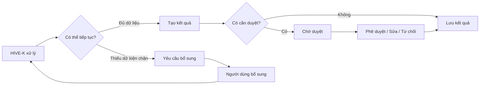

# 02 — Mô hình UX toàn hệ thống

## 1. Trạng thái chuẩn của một tiến trình

Mọi tiến trình AI hoặc đồng bộ dùng cùng một mô hình trạng thái:

| Trạng thái | Ý nghĩa trên UI | Hành động chính |
|---|---|---|
| `running` | Hệ thống đang xử lý | Xem tiến độ |
| `partial` | Đã có kết quả một phần | Xem kết quả và phần còn thiếu |
| `needs_user_input` | Cần người dùng bổ sung dữ liệu | Bổ sung thông tin |
| `needs_approval` | Cần quyết định của người có quyền | Duyệt |
| `completed` | Hoàn tất | Xem kết quả |
| `failed` | Không thể hoàn tất | Thử lại hoặc xem lỗi |
| `cancelled` | Đã dừng theo yêu cầu | Chạy lại |

Không dùng một spinner kéo dài cho toàn bộ quá trình.

## 2. Mô hình ưu tiên hành động

Mỗi màn hình chỉ có một hành động chính rõ ràng.

Thứ tự ưu tiên:

1. Xử lý vấn đề đang chặn.
2. Duyệt nội dung hoặc dữ kiện.
3. Tiếp tục công việc đang dang dở.
4. Tạo công việc mới.
5. Xem thông tin tham khảo.

## 3. Progressive disclosure

Chỉ hiển thị thông tin theo mức cần thiết:

### Mức 1 — Kết quả

Ví dụ: “HIVE-K đã xác định được 18 dữ kiện và còn 2 mục cần bạn xác nhận.”

### Mức 2 — Giải thích

Hiển thị lý do, mức ảnh hưởng và đề xuất xử lý.

### Mức 3 — Bằng chứng kỹ thuật

Nguồn, phiên bản, ngày cập nhật, độ tin cậy, lịch sử thay đổi.

## 4. Mô hình can thiệp của con người

## 5. Mô hình câu hỏi của hệ thống

Mỗi lượt hỏi:

- tối đa 3–5 mục;
- sắp xếp theo mức ảnh hưởng;
- nói rõ hệ thống đã kiểm tra nguồn nào;
- có hành động trực tiếp như “Mở tệp”, “Chọn dữ kiện đúng”, “Nhập giá hiện tại”;
- cho phép “Để sau” nếu không chặn công việc.

## 6. Mức nghiêm trọng

| Mức | Cách xử lý |
|---|---|
| Chặn | Không thể tạo hoặc đăng nội dung cho đến khi xử lý |
| Cảnh báo | Có thể tiếp tục nhưng bắt buộc duyệt |
| Gợi ý | Không ảnh hưởng luồng chính |
| Thông tin | Chỉ cung cấp ngữ cảnh |

Không chỉ phân biệt bằng màu. Luôn có nhãn và icon.

## 7. Lưu và khôi phục

- Trình soạn thảo tự lưu.
- Wizard lưu từng bước.
- Tiến trình dài tiếp tục được sau khi đóng tab.
- Khi quay lại, hiển thị “Tiếp tục từ bước…” thay vì bắt đầu lại.
- Khi dữ liệu nguồn thay đổi trong lúc người dùng đang chỉnh bài, cảnh báo trước khi áp dụng phiên bản mới.

## 8. Minh bạch AI

Mỗi kết quả AI nên hỗ trợ xem:

- dữ kiện đã dùng;
- nguồn dữ kiện;
- quy tắc giọng văn áp dụng;
- cảnh báo;
- thời điểm tạo;
- phiên bản hiện tại.

Không cần hiển thị prompt hoặc chuỗi suy luận nội bộ.

## 9. Undo và lịch sử

Bắt buộc có lịch sử cho:

- sửa dữ kiện;
- giải quyết mâu thuẫn;
- chỉnh sửa nội dung;
- thay đổi lịch đăng;
- thay đổi quyền;
- thay đổi quy trình duyệt.

Các hành động phá hủy phải có xác nhận và mô tả ảnh hưởng.
