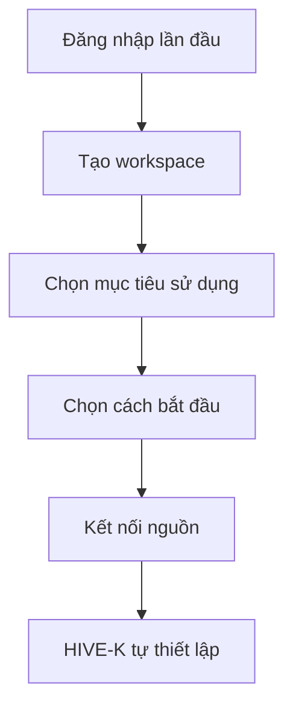

# 03 — Flow tạo Workspace và Onboarding

## 1. Mục tiêu

Đưa người dùng từ lần đăng nhập đầu tiên đến trạng thái bắt đầu kết nối dữ liệu trong thời gian ngắn, không bắt họ nhập toàn bộ hồ sơ thương hiệu thủ công.

## 2. Luồng chính

## 3. Màn hình `CreateWorkspacePage`

### Trường bắt buộc

- Tên workspace
- Loại hình hoạt động
- Khu vực hoặc thị trường chính
- Ngôn ngữ nội dung chính

### Trường không nên hỏi ở bước này

- toàn bộ sản phẩm;
- bảng giá;
- chân dung khách hàng chi tiết;
- tone of voice;
- FAQ;
- lịch đăng;
- quy tắc từng nền tảng.

Các dữ liệu này ưu tiên lấy từ nguồn kết nối.

### Hành động

- Chính: `Tạo workspace`
- Phụ: `Tham gia workspace bằng lời mời`

## 4. Bước chọn mục tiêu

Cho phép chọn nhiều mục tiêu:

- Quản lý nhiều tài khoản mạng xã hội
- Tạo kế hoạch nội dung
- Tạo bài tự động
- Duyệt và lên lịch đăng
- Tổng hợp tri thức thương hiệu
- Theo dõi hiệu quả

Mục tiêu chỉ dùng để ưu tiên onboarding; không khóa tính năng.

## 5. Bước chọn cách bắt đầu

Ba lựa chọn:

### Kết nối nguồn có sẵn

Đề xuất mặc định. Dành cho người dùng đã có website, Drive hoặc tài khoản mạng xã hội.

### Tải tài liệu lên

Dành cho người dùng có hồ sơ sản phẩm, bảng giá, FAQ hoặc kế hoạch cũ.

### Bắt đầu tối giản

Chỉ nhập thông tin cốt lõi để tạo bài thử. Hệ thống vẫn nhắc kết nối nguồn sau.

## 6. Trạng thái workspace

| Trạng thái     | Điều kiện                            | Trải nghiệm              |
| -------------- | ------------------------------------ | ------------------------ |
| Chưa thiết lập | Chưa có nguồn hoặc hồ sơ             | CTA kết nối nguồn        |
| Đang thiết lập | Có tiến trình xử lý                  | Hiển thị tiến độ         |
| Cần bổ sung    | Có mục chặn                          | CTA xử lý dữ liệu thiếu  |
| Cần hiệu chỉnh | Đủ dữ kiện, chưa có voice profile    | CTA hiệu chỉnh giọng văn |
| Sẵn sàng       | Đủ điều kiện MVP                     | CTA tạo kế hoạch         |
| Cần cập nhật   | Dữ kiện quan trọng hết hạn/mâu thuẫn | Cảnh báo trên dashboard  |

## 7. Thoát giữa chừng

Khi người dùng rời onboarding:

- lưu trạng thái;
- đưa họ vào dashboard tối giản;
- hiển thị checklist thiết lập;
- không chặn toàn bộ ứng dụng nếu họ vẫn có thể dùng một phần chức năng.

## 8. Tiêu chí nghiệm thu

- Người dùng có thể tạo workspace trong một màn hình chính.
- Không có form thương hiệu dài trong onboarding.
- Sau khi tạo workspace, CTA tiếp theo luôn rõ ràng.
- Người dùng quay lại được đúng bước đang dở.
- Có đường dẫn bỏ qua các bước không chặn.
