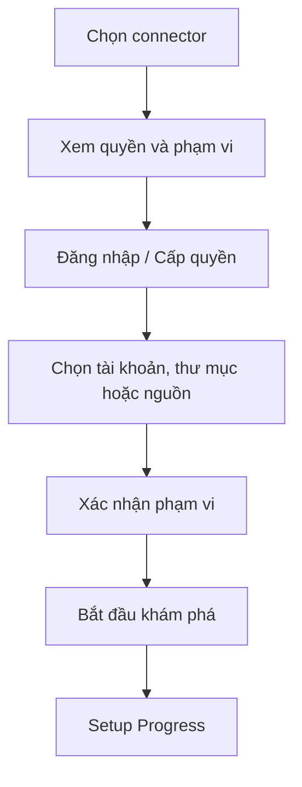

# 04 — Kết nối nguồn và theo dõi thiết lập

## 1. Các màn hình

- `ConnectSourcesPage`
- `ConnectorPermissionPage`
- `SourceSelectionPage`
- `SetupProgressPage`
- `ConnectorDetailPage`

## 2. `ConnectSourcesPage`

### Nhóm nguồn

- Google Drive
- Website
- Facebook / Instagram
- TikTok
- Tải tệp

Mỗi thẻ connector hiển thị:

- dữ liệu có thể đọc;
- dữ liệu có thể ghi;
- trạng thái hỗ trợ;
- quyền cần cấp;
- lần đồng bộ gần nhất;
- nút kết nối hoặc quản lý.

Không dùng nút chung “Cho phép tất cả”.

## 3. Flow kết nối

## 4. Chọn phạm vi dữ liệu

### Google Drive

- Chọn thư mục cụ thể.
- Hiển thị số tệp dự kiến.
- Cho phép loại trừ thư mục con.
- Mặc định chỉ đọc.

### Website

- Xác nhận tên miền.
- Hiển thị các trang tìm thấy.
- Cho phép chọn hoặc bỏ trang.
- Nêu rõ chỉ đọc nội dung công khai hoặc thuộc quyền quản lý.

### Mạng xã hội

- Chọn đúng tài khoản/page.
- Gán vai trò kênh ban đầu.
- Tách quyền đọc dữ liệu và quyền đăng.

### Tải tệp

- Hỗ trợ kéo thả.
- Hiển thị loại tệp, kích thước và trạng thái kiểm tra.
- Cho phép gắn nhãn: sản phẩm, bảng giá, FAQ, bài cũ, tài liệu thương hiệu.

## 5. `SetupProgressPage`

Không hiển thị pipeline kỹ thuật. Dùng các bước người dùng hiểu được:

1. Đang tìm nguồn
2. Đang đọc nội dung
3. Đang nhận diện sản phẩm và thông tin quan trọng
4. Đang kiểm tra dữ kiện trùng hoặc mâu thuẫn
5. Đang tạo bản chụp thương hiệu

Mỗi bước có:

- trạng thái;
- số lượng đối tượng đã xử lý;
- thời gian cập nhật gần nhất;
- lỗi có thể xử lý;
- kết quả một phần.

## 6. Hành vi khi xử lý nền

Người dùng có thể:

- rời trang;
- nhận thông báo khi hoàn tất;
- xem kết quả đã có;
- hủy run;
- thử lại riêng nguồn lỗi;
- thêm nguồn khác trong khi hệ thống tiếp tục xử lý.

## 7. Xử lý lỗi

### Mất quyền truy cập

Hiển thị:

- connector bị ảnh hưởng;
- dữ liệu nào không còn đồng bộ;
- nút cấp lại quyền;
- dữ liệu snapshot cũ vẫn còn hay không.

### Tệp không đọc được

Cho phép:

- tải tệp khác;
- bỏ qua;
- xem lý do;
- đánh dấu tệp không quan trọng.

### Đồng bộ một phần

Không đánh dấu toàn bộ run thất bại. Hiển thị:

- phần đã hoàn tất;
- phần chưa xử lý;
- ảnh hưởng đến readiness;
- nút thử lại phần lỗi.

## 8. Tiêu chí nghiệm thu

- Người dùng hiểu quyền đọc và quyền ghi.
- Có thể chọn phạm vi thay vì cấp toàn bộ dữ liệu.
- Tiến trình tiếp tục khi người dùng đóng trang.
- Lỗi một nguồn không làm mất kết quả các nguồn khác.
- Có thể mở trực tiếp nguồn gây ra dữ liệu thiếu hoặc mâu thuẫn.
