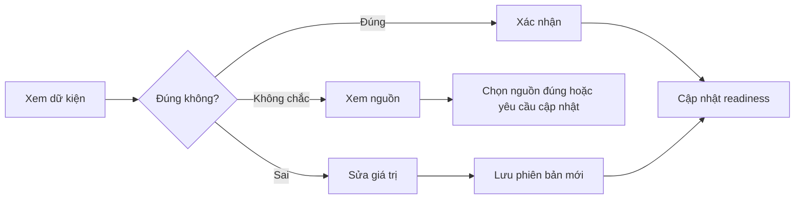

# 05 — Bản chụp thương hiệu và mức sẵn sàng

## 1. Mục tiêu

Cho phép người dùng kiểm tra HIVE-K đã hiểu gì mà không biến trang thành một form dài.

## 2. Cấu trúc `BrandSnapshotReviewPage`

### Phần đầu trang

- Tên phiên bản
- Ngày cập nhật
- Mức sẵn sàng
- Số dữ kiện đã xác nhận
- Số mục cần xử lý
- CTA chính theo vấn đề ưu tiên

### Các nhóm nội dung

1. Nhận diện thương hiệu
2. Sản phẩm và dịch vụ
3. Nhóm khách hàng
4. Ưu đãi và giá
5. Dữ kiện được phép dùng
6. Dữ kiện bị chặn
7. Câu hỏi thường gặp
8. Giọng văn
9. Vai trò kênh
10. Quy tắc nền tảng

Không hiển thị tất cả nhóm mở cùng lúc.

## 3. Mẫu thẻ dữ kiện

Mỗi dữ kiện hiển thị:

- tên trường;
- giá trị hiện tại;
- trạng thái xác nhận;
- nguồn chính;
- ngày quan sát;
- cảnh báo lỗi thời hoặc mâu thuẫn;
- hành động `Xác nhận`, `Sửa`, `Xem nguồn`.

## 4. Mức sẵn sàng

Mức sẵn sàng phải được giải thích bằng thành phần:

```text
Dữ kiện bắt buộc       8/10
Dữ kiện đã xác nhận    14/18
Khách hàng mục tiêu    Đủ
Giọng văn              Chưa hiệu chỉnh
Kết nối kênh           3/5
Mâu thuẫn chưa xử lý   2
```

Không chỉ hiển thị một vòng tròn phần trăm.

## 5. Flow xác nhận dữ kiện



## 6. Mục còn thiếu

Mỗi mục thiếu phải có:

- mức ảnh hưởng;
- lý do cần;
- nơi hệ thống đã tìm;
- cách bổ sung nhanh nhất;
- nút mở đúng tệp hoặc đúng form;
- lựa chọn để sau nếu không chặn.

## 7. Mâu thuẫn

Hiển thị hai hoặc nhiều giá trị song song:

| Giá trị | Nguồn | Ngày | Trạng thái |
| ------- | ----- | ---- | ---------- |

Hành động:

- Chọn giá trị đang hiệu lực
- Nhập giá trị mới
- Giữ cả hai với thời gian hiệu lực khác nhau
- Đánh dấu chưa thể xác định

Không tự xóa giá trị cũ.

## 8. Hiệu chỉnh giọng văn

Sau khi dữ kiện đủ:

1. HIVE-K tạo 3 bài mẫu có khác biệt rõ.
2. Người dùng chọn bài gần nhất.
3. Người dùng sửa trực tiếp.
4. Hệ thống tóm tắt các đặc điểm rút ra.
5. Người dùng xác nhận hoặc bỏ từng đặc điểm.
6. Tạo `Brand Voice Profile v1`.

## 9. Tiêu chí nghiệm thu

- Mỗi dữ kiện truy ngược được về nguồn.
- Người dùng phân biệt được dữ kiện đã xác nhận, chưa chắc và bị chặn.
- Mức sẵn sàng giải thích được.
- Người dùng không phải duyệt hàng chục mục không quan trọng cùng lúc.
- Giải quyết mâu thuẫn không làm mất lịch sử.
