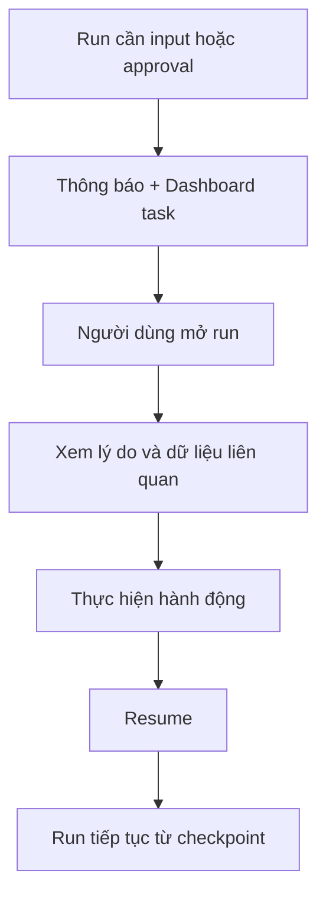

# 07 — Dashboard và tiến trình AI

## 1. Mục tiêu Dashboard

Trang chủ phải trả lời bốn câu hỏi:

1. Hôm nay cần xử lý gì?
2. Nội dung nào sắp đăng?
3. Hệ thống đang làm gì?
4. Hiệu quả gần đây có gì đáng chú ý?

## 2. Thứ tự nội dung trên Dashboard

### 1. Việc cần bạn xử lý

- dữ kiện chặn;
- bài chờ duyệt;
- connector mất quyền;
- bài đăng thất bại;
- mâu thuẫn ảnh hưởng lịch gần nhất.

### 2. Lịch sắp tới

- bài trong 24 giờ;
- bài chưa đủ dữ kiện;
- bài chưa có media;
- bài chưa được duyệt.

### 3. Tiến trình đang chạy

- thiết lập workspace;
- đồng bộ nguồn;
- tạo kế hoạch;
- tạo hàng loạt bài;
- thu chỉ số hiệu quả.

### 4. Tóm tắt hiệu quả

- mục tiêu kinh doanh;
- xu hướng tăng/giảm;
- bài nổi bật;
- cảnh báo dữ liệu chưa đủ.

## 3. Thẻ tiến trình

Mỗi run hiển thị:

- tên công việc dễ hiểu;
- trạng thái;
- bước hiện tại;
- tiến độ;
- thời gian cập nhật;
- kết quả tạm thời;
- hành động tiếp theo.

Ví dụ:

```text
Đang tạo kế hoạch tháng 8
Đã hoàn tất 3/5 bước
Hiện tại: kiểm tra phân bổ nội dung giữa các kênh
[Theo dõi] [Hủy]
```

## 4. Trang chi tiết `RunDetailPage`

Timeline:

- Run bắt đầu
- Nguồn đã đọc
- Dữ kiện thiếu phát hiện
- Bản nháp được tạo
- Kiểm tra hoàn tất
- Chờ người dùng
- Run hoàn tất hoặc lỗi

Chỉ hiển thị thông tin kỹ thuật cho vai trò quản trị hoặc chế độ hỗ trợ.

## 5. Resume flow



## 6. Lỗi và thử lại

Phân biệt:

- lỗi tạm thời: tự thử lại;
- lỗi cần quyền: yêu cầu kết nối lại;
- lỗi dữ liệu: yêu cầu sửa nguồn;
- lỗi hệ thống: cho phép gửi mã hỗ trợ;
- lỗi một phần: giữ kết quả đã hoàn thành.

## 7. Notification center

Nhóm thông báo:

- Cần hành động
- Nội dung
- Dữ liệu và kết nối
- Phân tích
- Hệ thống

Thông báo đã xử lý không tiếp tục xuất hiện như một task.

## 8. Tiêu chí nghiệm thu

- Dashboard không biến thành trang biểu đồ.
- Các việc chặn được ưu tiên trước KPI.
- Người dùng xem và tiếp tục run được.
- Có trạng thái kết quả một phần.
- Không buộc người dùng giữ tab mở khi AI đang xử lý.
