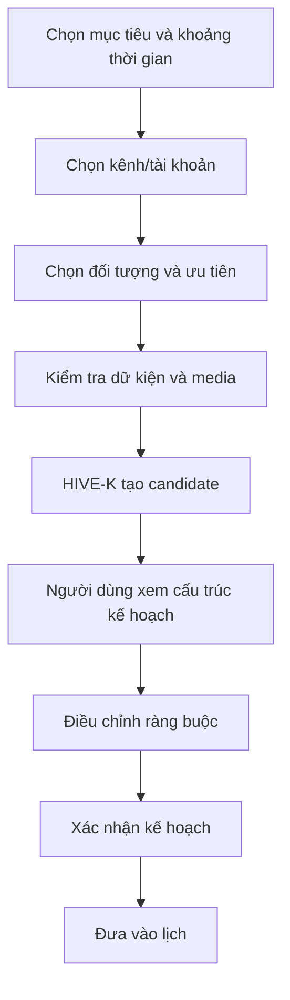

# 08 — Lập kế hoạch nội dung và lịch

## 1. Entry points

Người dùng có thể tạo kế hoạch từ:

- Dashboard
- Trang Kế hoạch
- Lịch nội dung
- Một insight hoặc trend
- Một chiến dịch/ưu đãi mới

## 2. Flow tạo kế hoạch

## 3. Bước 1 — Mục tiêu

Trường chính:

- thời gian kế hoạch;
- mục tiêu kinh doanh;
- chiến dịch hoặc sản phẩm;
- chỉ số ưu tiên;
- số bài mong muốn.

Dùng preset theo nhu cầu nhưng cho phép chỉnh.

## 4. Bước 2 — Kênh và vai trò

Không chỉ chọn nền tảng. Hiển thị:

- tài khoản;
- vai trò kênh;
- đối tượng chính;
- giới hạn bài/ngày;
- khung giờ;
- quyền đăng.

Ví dụ vai trò:

- page thương hiệu;
- page khu vực;
- cộng đồng;
- tài khoản tư vấn;
- kênh chăm sóc khách hàng.

## 5. Bước 3 — Ràng buộc nội dung

Cho phép đặt:

- tỷ lệ nhận biết / cân nhắc / chuyển đổi;
- tỷ lệ bài bán hàng;
- chủ đề bắt buộc;
- chủ đề không dùng;
- media sẵn có;
- trend được phép;
- thời gian hoặc ưu đãi có hiệu lực.

## 6. Màn hình kết quả kế hoạch

Hiển thị theo hai chế độ:

### Chế độ chiến lược

- mục tiêu;
- phân bổ tầng phễu;
- content pillar;
- phân bổ kênh;
- mức độ lặp;
- khoảng trống.

### Chế độ lịch

- ngày và giờ;
- tài khoản;
- loại bài;
- trạng thái;
- dữ kiện/media còn thiếu.

## 7. Content node card

Mỗi node có:

- ý tưởng/hook;
- mục tiêu;
- đối tượng;
- kênh;
- tầng phễu;
- định dạng;
- dữ kiện cần;
- trend/pattern;
- mức rủi ro;
- trạng thái tạo bài.

Hành động:

- tạo bài;
- đổi ngày;
- đổi tài khoản;
- thay angle;
- nhân bản có kiểm soát;
- bỏ khỏi kế hoạch.

## 8. Điều chỉnh kế hoạch

Khi người dùng kéo thả:

- kiểm tra giới hạn tài khoản;
- cảnh báo trùng angle;
- cảnh báo quá nhiều bài bán hàng;
- cảnh báo fact hết hạn;
- cập nhật phân bổ tổng thể ngay;
- không tự thay đổi những node khác nếu chưa thông báo.

## 9. Tạo nhiều bài

Khi tạo hàng loạt:

- cho phép chọn node;
- ước lượng thời gian và mức sử dụng;
- hiển thị tiến độ từng bài;
- bài lỗi không làm dừng toàn bộ batch;
- kết quả luôn vào trạng thái cần duyệt.

## 10. Tiêu chí nghiệm thu

- Người dùng nhìn được kế hoạch ở cả cấp chiến lược và lịch.
- Không tạo các bài quá giống nhau mà không cảnh báo.
- Có cảnh báo fact/media trước khi tạo đầy đủ.
- Kéo thả lịch vẫn giữ ràng buộc.
- Người dùng kiểm soát được tài khoản đích của từng bài.
