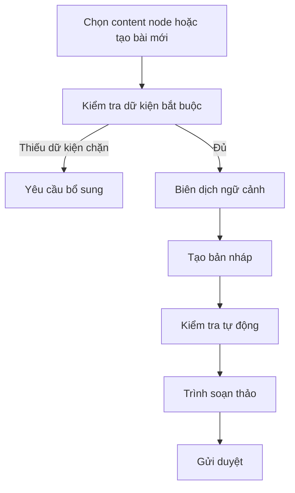

# 09 — Tạo bài và trình soạn thảo

## 1. Luồng tạo bài

## 2. Layout đề xuất

### Khu vực chính

Trình soạn nội dung theo định dạng nền tảng.

### Panel bên phải

Các tab:

- Yêu cầu bài
- Dữ kiện đã dùng
- Kiểm tra
- Nguồn tham khảo
- Lịch sử phiên bản

### Thanh trên

- nền tảng;
- tài khoản;
- trạng thái;
- lần tự lưu;
- người đang chỉnh;
- hành động gửi duyệt.

## 3. Trạng thái trước khi tạo

Hiển thị checklist:

- đối tượng;
- mục tiêu;
- kênh;
- dữ kiện bắt buộc;
- media;
- giọng văn;
- pattern/trend nếu có.

Nếu thiếu dữ kiện chặn, không hiển thị prompt trống. Hiển thị hành động sửa đúng vấn đề.

## 4. Tiến trình tạo bài

Các bước dễ hiểu:

1. Chuẩn bị dữ kiện
2. Chọn cấu trúc phù hợp
3. Tạo nội dung
4. Kiểm tra dữ kiện và quy tắc
5. Lưu bản nháp

Có thể đóng panel mà không mất run.

## 5. Trình soạn thảo

Hỗ trợ:

- chỉnh văn bản trực tiếp;
- preview theo nền tảng;
- chèn media;
- chèn dữ kiện được duyệt;
- xem giới hạn ký tự;
- xem CTA;
- xem hashtag;
- autosave;
- version history.

Không tự thay nội dung người dùng vừa sửa khi AI tiếp tục chạy.

## 6. Regenerate có định hướng

Không dùng một nút “Tạo lại” mơ hồ. Cho phép chọn:

- ngắn hơn;
- rõ lợi ích hơn;
- ít bán hàng hơn;
- đổi hook;
- đổi CTA;
- phù hợp kênh hơn;
- dùng angle khác;
- nhập lý do tùy chỉnh.

Phạm vi tạo lại:

- đoạn đang chọn;
- hook;
- CTA;
- toàn bài.

## 7. Kiểm tra nội dung

Nhóm kết quả:

- Dữ kiện
- Quy tắc thương hiệu
- Phù hợp nền tảng
- Trùng lặp
- Rủi ro
- Độ hoàn chỉnh

Mỗi cảnh báo phải:

- trỏ đúng đoạn;
- giải thích;
- nêu nguồn hoặc quy tắc;
- có hành động sửa;
- không tự sửa claim quan trọng.

## 8. Dữ kiện và nguồn

Panel dữ kiện hiển thị:

- dữ kiện được dùng;
- dữ kiện chưa dùng;
- dữ kiện còn thiếu;
- nguồn;
- trạng thái xác nhận.

Click dữ kiện phải highlight đoạn liên quan trong bài khi có thể.

## 9. Học từ chỉnh sửa

Sau khi người dùng chỉnh nhiều:

- hệ thống có thể đề xuất “Bạn thường bỏ emoji ở LinkedIn. Lưu thành quy tắc?”
- người dùng chọn `Lưu`, `Không lưu`, `Chỉ áp dụng bài này`.
- không tự biến một lần sửa thành preference ổn định.

## 10. Tiêu chí nghiệm thu

- Người dùng hiểu tại sao bài bị chặn hoặc cảnh báo.
- Có preview theo nền tảng.
- Autosave và version history hoạt động.
- Regenerate không xóa chỉnh sửa ngoài phạm vi.
- Mỗi claim quan trọng có thể xem nguồn.
