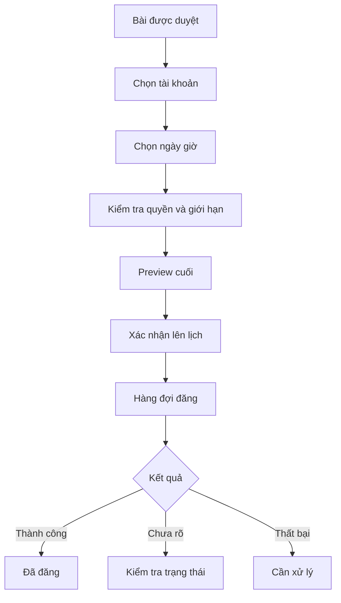

# 10 — Duyệt, lên lịch và đăng bài

## 1. Hàng chờ duyệt

Bộ lọc:

- người gửi;
- tài khoản;
- nền tảng;
- chiến dịch;
- trạng thái kiểm tra;
- hạn đăng;
- mức rủi ro;
- người duyệt.

Sắp xếp mặc định:

1. Bài sắp đến hạn
2. Bài có vấn đề chặn
3. Bài chờ lâu
4. Bài thông thường

## 2. Màn hình review

Hiển thị song song:

- preview bài;
- mục tiêu và brief;
- dữ kiện đã dùng;
- kết quả kiểm tra;
- lịch sử chỉnh sửa;
- lịch đăng;
- tài khoản đích.

Hành động:

- Phê duyệt
- Yêu cầu chỉnh sửa
- Chỉnh trực tiếp
- Từ chối
- Phê duyệt và lên lịch

## 3. Phản hồi review

Khi yêu cầu chỉnh sửa hoặc từ chối:

- bắt buộc chọn lý do;
- cho phép comment vào đoạn;
- phân biệt lỗi dữ kiện, giọng văn, chiến lược, hình ảnh và tuân thủ;
- phản hồi trở thành dữ liệu học nhưng không tự động thành quy tắc.

## 4. Cổng duyệt bắt buộc

Phải có phê duyệt trước:

- giá mới;
- ưu đãi mới;
- lịch mới;
- cam kết kết quả;
- chính sách;
- nội dung rủi ro;
- đăng bài;
- gửi tin nhắn;
- thay đổi tài khoản đích.

## 5. Flow lên lịch



## 6. Preview cuối

Bắt buộc hiển thị:

- nội dung;
- media;
- tài khoản;
- ngày giờ và múi giờ;
- người phê duyệt;
- dữ kiện nhạy cảm;
- các thay đổi sau lần duyệt gần nhất.

Nếu nội dung thay đổi sau duyệt, yêu cầu duyệt lại theo policy.

## 7. Trạng thái bài

```text
draft
needs_review
changes_requested
approved
scheduled
publishing
published
partially_published
failed
cancelled
archived
```

## 8. Publish nhiều kênh

Mỗi kênh là một trạng thái riêng.

Ví dụ:

```text
Facebook: Đã đăng
Instagram: Đang kiểm tra trạng thái
LinkedIn: Thất bại — token hết hạn
```

Không hiển thị “Đăng thất bại” cho toàn bộ nếu chỉ một kênh lỗi.

## 9. Xử lý lỗi đăng

- Không retry mù quáng khi trạng thái chưa rõ.
- Có nút kiểm tra trạng thái.
- Có idempotency để tránh đăng trùng.
- Cho phép đổi lịch hoặc kết nối lại.
- Giữ audit đầy đủ.
- Không tự đổi tài khoản đích.

## 10. Tiêu chí nghiệm thu

- Bài không thể publish nếu thiếu approval bắt buộc.
- Preview cuối đúng tài khoản và múi giờ.
- Nội dung thay đổi sau duyệt được phát hiện.
- Publish nhiều kênh có trạng thái riêng.
- Thử lại không tạo bài trùng.
