## 1) Mục tiêu của 2 cụm page này

### Campaigns

Đây là nơi KOL/KOC:

* tìm campaign phù hợp
* quản lý đơn apply
* xử lý lời mời từ brand
* theo dõi campaign đang chạy
* nộp KPI/proof
* xem lịch sử hợp tác

Điều này bám đúng luồng sản phẩm: KOL có thể xem campaign mở, apply, được duyệt, thực hiện chiến dịch, submit KPI, rồi được chấm điểm/review.  

### Profiles

Đây là nơi KOL/KOC:

* xây hồ sơ nghề nghiệp
* chứng minh năng lực
* tăng điểm match với brand
* tạo public identity minh bạch
* liên kết sang ranking / verification

Phần này cũng đúng với mô tả: KOL/KOC cần hồ sơ cá nhân gồm niche, follower, engagement, portfolio, social platforms, và có thể public/verified.  

---

# 2) Cụm page Campaigns cho KOL/KOC

Mình đề xuất chia thành 5 page chính:

```txt
/ambassador/campaigns/discover
/ambassador/campaigns/invitations
/ambassador/campaigns/applied
/ambassador/campaigns/active
/ambassador/campaigns/history
```

và 1 page detail:

```txt
/ambassador/campaigns/[id]
/ambassador/campaigns/[id]/submit-kpi
```

---

## 3) Trang Discover Campaigns

### Mục tiêu

Cho KOL/KOC tìm các campaign mở và apply.

### Bố cục

**Header**

* tiêu đề: Discover Campaigns
* subtitle: tìm cơ hội hợp tác phù hợp với hồ sơ của bạn

**Thanh filter trên cùng**

* search keyword
* platform
* niche
* budget range
* follower requirement
* location
* campaign type
* sort: newest / best match / highest budget / closing soon

**Khối main**

* grid/list các campaign card

**Sidebar phải hoặc drawer filter**

* match score
* profile completeness warning
* gợi ý campaign dựa trên niche hiện tại

### Nội dung mỗi campaign card

* tên campaign
* brand name
* sản phẩm/ngành
* budget / fee range
* platforms yêu cầu
* follower range
* deadline apply
* match score
* 2 CTA:

  * View details
  * Apply

### Component đề xuất

* `CampaignSearchBar`
* `CampaignFilterChips`
* `CampaignSortSelect`
* `CampaignMatchBadge`
* `CampaignCard`
* `RecommendedCampaignsPanel`

### Chức năng

* filter realtime
* lưu recent filters
* đánh dấu saved campaign
* apply nhanh
* xem chi tiết

### Ghi chú UX

Nếu hồ sơ creator còn thiếu dữ liệu, nên hiện warning:

* thiếu follower
* thiếu portfolio
* thiếu social account
* chưa verified

vì những thứ này ảnh hưởng trực tiếp đến matching. Matching engine trong sản phẩm dựa vào niche, follower range, engagement, conversion history, rating, budget. 

---

## 4) Trang Invitations

### Mục tiêu

Cho KOL/KOC xử lý các lời mời chủ động từ business.

### Bố cục

**Header**

* Invitations
* hiển thị số lượng pending

**Tabs**

* All
* Pending
* Accepted
* Declined
* Expired

**Danh sách invitation**
Mỗi item gồm:

* brand
* campaign title
* mô tả ngắn
* fee đề xuất
* deadline phản hồi
* KPI yêu cầu chính
* badge “direct invite”

### CTA

* Accept
* Decline
* View detail

### Component

* `InvitationStatusTabs`
* `InvitationCard`
* `InviteSummaryBar`

### Chức năng

* chấp nhận lời mời
* từ chối
* xem điều kiện hợp tác
* archive lời mời cũ
* so sánh nhiều lời mời

### Ghi chú logic

Khi accept:

* tạo participant status `ACCEPTED`
* chuyển sang Active Campaigns

Khi decline:

* lưu trạng thái declined
* không còn hiện trong pending

Trạng thái participant tối thiểu gồm pending, accepted, posting, completed, failed.  

---

## 5) Trang Applied Campaigns

### Mục tiêu

Cho creator theo dõi các campaign mình đã ứng tuyển.

### Bố cục

**Header**

* Applied Campaigns

**Tabs**

* Under Review
* Shortlisted
* Rejected
* Withdrawn

**Danh sách**
Mỗi item:

* campaign
* brand
* ngày apply
* trạng thái
* fee đề xuất
* match score lúc apply
* ghi chú từ business nếu có

### CTA

* View application
* Withdraw application
* Re-apply nếu mở lại

### Component

* `AppliedCampaignTable`
* `ApplicationStatusBadge`
* `WithdrawApplicationDialog`

### Chức năng

* xem trạng thái xét duyệt
* xem lại nội dung apply
* rút đơn
* nhận thông báo khi có cập nhật

---

## 6) Trang Active Campaigns

### Mục tiêu

Đây là trang quan trọng nhất sau Dashboard. Nơi KOL/KOC vận hành công việc.

### Bố cục

**Header**

* Active Campaigns
* summary: số campaign đang chạy, sắp tới deadline, đang chờ verify KPI

**Tabs**

* All
* Posting
* Waiting Verification
* Completed
* Failed

**Main content**
dạng table hoặc cards có:

* campaign name
* brand
* timeline
* status
* KPI progress
* next deadline
* approval state

### Mỗi item hiển thị

* tên chiến dịch
* ngày bắt đầu / kết thúc
* KPI target chính
* progress bar
* proof status
* CTA:

  * Open campaign
  * Submit KPI
  * View brief

### Component

* `ActiveCampaignTable`
* `CampaignProgressBar`
* `KpiStatusPill`
* `DeadlineWarningTag`

### Chức năng

* xem campaign đang thực hiện
* thấy deadline gần
* thấy KPI đã submit hay chưa
* vào trang chi tiết campaign
* nộp proof

---

## 7) Trang Campaign Detail

### Mục tiêu

Cho creator xem toàn bộ brief và tiến trình của một campaign cụ thể.

### Layout đề xuất

#### Khu 1: Header summary

* campaign name
* brand
* trạng thái
* timeline
* fee / reward
* CTA chính: Submit KPI

#### Khu 2: Brief

* mục tiêu campaign
* audience
* deliverables
* content guideline
* cấm gì / bắt buộc gì
* hashtag / CTA / link tracking

#### Khu 3: KPI Targets

* reach target
* views
* CTR
* conversions
* progress hiện tại

#### Khu 4: Submission Timeline

* accepted
* posting
* submitted
* verified
* completed

#### Khu 5: Attachments / Assets

* media kit
* brief PDF
* tracking links
* product assets

#### Khu 6: Review / Notes

* feedback từ business
* yêu cầu chỉnh sửa
* trạng thái xác nhận

### Component

* `CampaignDetailHeader`
* `CampaignBriefCard`
* `CampaignKpiSection`
* `SubmissionTimeline`
* `CampaignAssetsPanel`
* `BrandFeedbackPanel`

### Chức năng

* xem toàn bộ thông tin chiến dịch
* tải tài liệu
* theo dõi tiến độ
* nộp KPI/proof
* xem business feedback

---

## 8) Trang Submit KPI / Proof

### Mục tiêu

Cho creator nhập dữ liệu hiệu suất và bằng chứng hoàn thành.

### Form fields

* posting URL
* postedAt
* views
* likes
* comments
* shares
* clicks
* conversions
* note
* upload screenshot / analytics proof

Đây bám đúng mô hình KPI tracking manual submission + verify + tracking link.  

### Bố cục

* bên trái: form submit
* bên phải: target KPI + hướng dẫn + trạng thái verify

### Trạng thái

* Draft
* Submitted
* Needs Revision
* Verified

### Component

* `KpiSubmissionForm`
* `ProofUploader`
* `KpiTargetSummary`
* `VerificationStatusCard`

### Chức năng

* lưu nháp
* submit chính thức
* sửa khi bị yêu cầu bổ sung
* xem attainment %

---

## 9) Trang Campaign History

### Mục tiêu

Cho KOL/KOC nhìn lại lịch sử hợp tác để xây uy tín.

### Hiển thị

* campaign đã hoàn thành
* completion rate
* average rating
* KPI achieved %
* brand feedback
* public transparency impact

### Component

* `CampaignHistoryTable`
* `CompletionStatsPanel`
* `PastReviewsList`

---

# 10) Cụm page Profiles cho KOL/KOC

Mình đề xuất chia thành 3 page:

```txt
/ambassador/profile
/ambassador/profile/edit
/ambassador/profile/public-preview
```

và public-facing:

```txt
/kol/[slug]
/kol-verification/[id]
```

---

## 11) Trang My Profile

### Mục tiêu

Đây là hồ sơ làm việc nội bộ của creator.

### Layout tổng thể

#### Khu 1: Hero profile

* avatar
* display name
* verified badge
* niche
* city/location
* follower tổng
* engagement rate
* score
* nút Edit Profile
* nút Preview Public Profile

#### Khu 2: Profile completeness

card hiển thị:

* 75% complete
* checklist còn thiếu:

  * portfolio
  * pricing
  * TikTok link
  * audience demographics

#### Khu 3: Professional info

* bio
* niche/category
* content style
* audience type
* working platforms
* language
* location

#### Khu 4: Performance highlights

* follower count theo platform
* engagement rate
* average views
* completed campaigns
* rating
* conversion performance nếu có

#### Khu 5: Portfolio

* bài nổi bật
* video nổi bật
* brand từng hợp tác
* media kit / CV

#### Khu 6: Commercial info

* booking range
* collaboration formats
* available campaign types
* preferred industries

### Component

* `ProfileHeroCard`
* `ProfileCompletionChecklist`
* `PlatformStatsGrid`
* `PortfolioGallery`
* `CommercialInfoCard`

### Chức năng

* xem toàn bộ hồ sơ
* kiểm tra mức hoàn chỉnh
* vào edit
* preview bản public

---

## 12) Trang Edit Profile

### Form nên chia step/tab

### Tab 1: Basic Info

* avatar
* display name
* legal name nếu cần internal
* bio
* location
* languages

### Tab 2: Creator Info

* niche
* content categories
* audience demographics
* content tone/style
* preferred platforms

### Tab 3: Social Accounts

* TikTok
* Instagram
* Facebook
* YouTube
* Threads
* website/personal link

### Tab 4: Performance Metrics

* follower count
* average reach
* engagement rate
* average views
* conversion proof nếu có

### Tab 5: Portfolio

* upload videos
* image posts
* case studies
* CV / media kit

### Tab 6: Commercial Settings

* fee range
* campaign formats accepted
* availability
* collaboration notes

### Tab 7: Visibility & Verification

* profile public/private
* show/hide selected metrics
* request verification

### Component

* `ProfileEditStepper`
* `BasicInfoForm`
* `SocialAccountsForm`
* `MetricsForm`
* `PortfolioUploader`
* `VisibilitySettingsForm`

### Chức năng

* autosave
* validate theo field
* preview public
* request verification
* lưu version changes

### Logic dữ liệu

Các field quan trọng nhất cho matching là:

* niche
* follower count
* engagement rate
* rating/history
* budget/fee fit

vì đó là đầu vào của matching engine. 

---

## 13) Trang Public Preview

### Mục tiêu

Cho KOL/KOC xem trước public page của mình trước khi publish.

### Hiển thị

* avatar
* intro
* platform stats
* badges
* completed campaigns
* public reviews
* verification block
* transparency block

### CTA

* Publish
* Edit More
* Copy Public Link

---

## 14) Public Profile page

### Mục tiêu

Đây là trang public để brand/người dùng xem creator một cách minh bạch.

### Bố cục

#### Khu 1: Public hero

* avatar
* tên
* niche
* verified
* rank
* score
* social links

#### Khu 2: Overview

* bio
* content focus
* audience
* brand fit

#### Khu 3: Stats

* followers
* engagement
* completion rate
* average rating

#### Khu 4: Campaign history

* các campaign đã public
* trạng thái completed
* highlights

#### Khu 5: Reviews

* feedback từ brand
* feedback người dùng

#### Khu 6: Transparency / Verification

* verified certificate
* disclosure score
* trust score

Trang public này gắn trực tiếp với Public Transparency Dashboard và ranking/verification. 

---

## 15) Thiết kế hình ảnh cho 2 cụm page

Theo style hiện tại của Hive-K:

* nền xám rất nhạt
* card trắng
* border nhẹ
* radius 12px
* shadow subtle
* button amber
* analytics blue
* creator/badge purple

Palette đã chốt:

* Primary `#F59E0B`
* Secondary `#FB923C`
* Tech Blue `#3B82F6`
* Creator Purple `#8B5CF6`
* neutral text/border/background như style guide. 

### Áp dụng cụ thể

**Campaign pages**

* emphasis vào CTA, deadlines, status
* màu cảnh báo deadline: orange
* verified KPI: green
* analytics/progress: blue

**Profile pages**

* emphasis vào badge, trust, creator identity
* badge/reputation: purple
* primary edit/publish: amber

---

## 16) Route map tổng hợp

```txt
/ambassador/dashboard

/ambassador/campaigns/discover
/ambassador/campaigns/invitations
/ambassador/campaigns/applied
/ambassador/campaigns/active
/ambassador/campaigns/history
/ambassador/campaigns/[id]
/ambassador/campaigns/[id]/submit-kpi

/ambassador/profile
/ambassador/profile/edit
/ambassador/profile/public-preview

/kol/[slug]
/kol-verification/[id]
```

Route này cũng khớp tốt với structure hiện có: đã có `ambassador/dashboard`, `campaigns`, `campaigns/[id]`, `kol-verification/[id]`, và có thể mở rộng thêm mà không phá kiến trúc hiện tại. 

---

## 17) Luồng giữa Campaigns và Profiles

```mermaid
flowchart LR
    A[Creator cập nhật Profile] --> B[Profile Completeness tăng]
    B --> C[Matching tốt hơn]
    C --> D[Discover Campaigns]
    D --> E[Apply hoặc nhận Invitation]
    E --> F[Active Campaign]
    F --> G[Submit KPI / Proof]
    G --> H[Campaign Completed]
    H --> I[Review + Reputation Score]
    I --> J[Public Profile / Verification / Ranking]
```



Ý chính là:

* **Profile tốt hơn** → match tốt hơn
* **Campaign làm tốt hơn** → reputation tốt hơn
* **Reputation tốt hơn** → public profile mạnh hơn
* **public profile mạnh hơn** → dễ được mời campaign hơn

Đây chính là vòng lặp giá trị của Hive-K.  

---

## 18) Chốt ưu tiên MVP

Nên làm trước:

### Campaigns

* Discover
* Invitations
* Applied
* Active
* Campaign Detail
* Submit KPI

### Profiles

* My Profile
* Edit Profile
* Public Preview basic
* Public Profile basic
* Verification block basic

Chưa cần làm sâu ngay:

* earnings wallet
* auto social sync
* advanced audience analytics
* AI-generated profile insights
