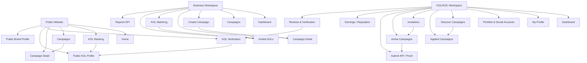
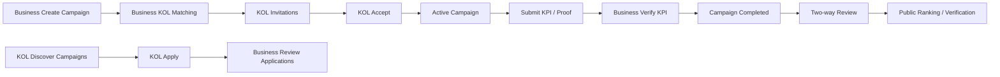

Nếu bạn hỏi **“tầm/sitemap sơn sao?” = “sitemap tổng quan cho cụm KOL/KOC nên làm sao?”**, thì nên chốt theo kiểu này:

## 1) Vị trí của KOL/KOC trong toàn site

Hive-K có 3 lớp chính:

* **Public site**: ai cũng xem được
* **Workspace Business/Agency**: quản lý campaign, matching, KPI
* **Workspace KOL/KOC**: hồ sơ, cơ hội hợp tác, chiến dịch đang chạy

Cách chia này bám đúng mô hình sản phẩm: Business tạo campaign, KOL/KOC tạo hồ sơ và apply, người dùng phổ thông xem ranking/xác minh/đánh giá.  

---

## 2) Sitemap tổng quan nên là



---

## 3) KOL/KOC page map nên có gì

### A. KOL/KOC workspace private

Đây là phần người làm KOL/KOC đăng nhập để thao tác.

1. **KOL Dashboard**

   * tổng campaign đang tham gia
   * lời mời mới
   * KPI pending
   * điểm uy tín / badge
   * thu nhập hoặc reward tạm tính

2. **My Profile**

   * avatar, bio
   * niche
   * follower count
   * engagement rate
   * nền tảng hoạt động
   * khu vực
   * giá hợp tác / booking range
   * visibility public/private

3. **Portfolio & Social Accounts**

   * link TikTok / Facebook / Instagram / YouTube
   * bài nổi bật
   * case study
   * file media kit

4. **Discover Campaigns**

   * danh sách campaign mở
   * filter theo niche, platform, budget
   * nút apply

5. **Applied Campaigns**

   * campaign đã apply
   * trạng thái chờ duyệt / bị từ chối / được nhận

6. **Invitations**

   * lời mời trực tiếp từ brand
   * accept / decline

7. **Active Campaigns**

   * campaign đã nhận
   * deadline
   * brief
   * KPI target
   * trạng thái: accepted / posting / completed / failed

8. **Submit KPI / Proof**

   * link bài đăng
   * ngày đăng
   * views / likes / comments / clicks / conversions
   * upload screenshot / proof

9. **Reputation / Score**

   * completion rate
   * KPI achievement
   * rating từ brand
   * badge: verified, top performer...

10. **Reviews & Verification**

* feedback từ brand
* lịch sử hợp tác
* trạng thái xác minh

Các phần này khớp trực tiếp với module đã mô tả: KOL profile, application system, KPI tracking, rating, public transparency.  

---

## 4) Liên kết với page hiện có

Trong structure hiện tại bạn đã có sẵn nhiều page public/business, nên phần KOL/KOC chỉ cần nối như sau: `kol-ranking`, `campaigns`, `campaigns/[id]`, `kol-verification/[id]`, `ambassador/dashboard`, `business/dashboard`, `kol-matching`. 

### Mapping hợp lý:

* `/(public)/kol-ranking`
  -> click vào KOL
  -> `/(public)/kol/[slug]` hoặc dùng `kol-verification/[id]`

* `/(public)/campaigns`
  -> click campaign
  -> `/(public)/campaigns/[id]`
  -> nếu user là KOL và đăng nhập, có nút **Apply**

* `/(business)/kol-matching`
  -> chọn KOL
  -> gửi invite
  -> xuất hiện ở `KOL Workspace / Invitations`

* `ambassador/dashboard`
  -> nên mở rộng thành hub chính cho KOL/KOC
  -> từ đây đi tới:

  * profile
  * discover campaigns
  * invitations
  * active campaigns
  * submit KPI
  * reputation

---

## 5) Route đề xuất cho KOL/KOC

Nếu theo structure hiện tại, mình đề xuất thêm:

```txt
/app
  /ambassador/dashboard
  /ambassador/profile
  /ambassador/portfolio
  /ambassador/campaigns/discover
  /ambassador/campaigns/applied
  /ambassador/campaigns/invitations
  /ambassador/campaigns/active
  /ambassador/campaigns/[id]
  /ambassador/campaigns/[id]/submit-kpi
  /ambassador/reputation
  /ambassador/reviews
  /ambassador/verification
```

và public:

```txt
/public
  /kol-ranking
  /kol/[slug]
  /kol-verification/[id]
```

---

## 6) Quan hệ giữa KOL/KOC với Business pages



Luồng này bám sát business flow trong tài liệu: Business tạo campaign, system suggest KOL, KOL accept/apply, theo dõi KPI, hoàn thành rồi đánh giá hai chiều. 

---

## 7) Cách tổ chức menu KOL/KOC gọn nhất

Menu trái cho KOL/KOC:

* Dashboard
* My Profile
* Discover Campaigns
* Invitations
* Applied
* Active Campaigns
* Reputation
* Verification

Menu này đủ gọn cho MVP, đúng với giai đoạn đầu: đăng ký role, tạo hồ sơ, apply campaign, manual KPI update, basic rating. 

---

## 8) Nên ưu tiên page nào trước

### MVP

* KOL Dashboard
* My Profile
* Discover Campaigns
* Invitations / Applied
* Active Campaign Detail
* Submit KPI
* Reputation basic

### P1

* portfolio đẹp hơn
* scoring chi tiết
* badge logic
* lịch sử campaign public profile

### P2

* auto sync social metrics
* fraud detection
* AI recommendation

Điều này cũng đúng với roadmap MVP → Phase 2 → Phase 3 trong tài liệu.  

---

## 9) Kết luận ngắn

**KOL/KOC nên là 1 workspace riêng**, nhưng phải nối chặt với:

* public ranking
* public verification
* public campaign list
* business matching
* business campaign detail

Tức là nhìn tổng thể sẽ là:

* **Public** để minh bạch và SEO
* **Business app** để vận hành
* **KOL/KOC app** để tham gia và xây uy tín

Nếu muốn, mình sẽ làm tiếp ngay cho bạn một bản **markdown sitemap hoàn chỉnh dạng copy-paste**, có luôn:

* tree page
* route
* mô tả từng page
* liên kết giữa page hiện có và page mới KOL/KOC.
