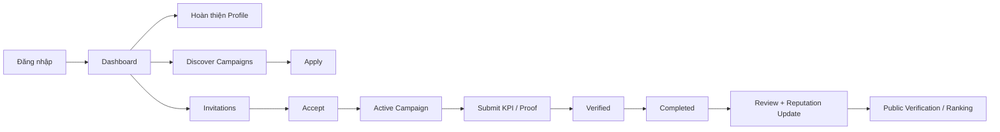

Dưới đây là bản **mô tả + thiết kế + chức năng** cho **trang KOL/KOC Workspace** của Hive-K.

## 1) Mục tiêu của workspace

Workspace này là khu vực làm việc riêng cho KOL/KOC sau khi đăng nhập. Vai trò chính của nó là giúp creator:

* tìm cơ hội hợp tác
* xây hồ sơ nghề nghiệp
* theo dõi campaign đang tham gia
* nộp KPI/proof
* tích lũy điểm uy tín, badge, review

Điều này bám đúng định hướng sản phẩm: KOL/KOC là nhóm “tìm thương hiệu hợp tác, xây dựng uy tín, tăng thu nhập”, đồng thời hệ thống có KPI tracking, rating, ranking và transparency.  

---

## 2) Vai trò của page này trong toàn hệ thống

KOL/KOC workspace không phải một page đơn lẻ, mà là **1 cụm page có chung layout** trong app riêng của creator. Theo thiết kế kỹ thuật hiện tại, nhánh này tương ứng với khu `/app/kol/*` hoặc bản demo `/ambassador/dashboard`, trong đó có dashboard, profile, campaigns và các page chi tiết. Workspace cá nhân hóa nên nên render động/SSR thay vì static.  

---

## 3) Mục tiêu UX

Trang này phải cho creator cảm giác:

* **rõ việc cần làm hôm nay**
* **biết campaign nào đang chờ phản hồi**
* **thấy tiến độ KPI đang đạt tới đâu**
* **thấy điểm uy tín của mình đang tăng hay giảm**
* **ra quyết định nhanh**: apply, accept, submit, cập nhật profile

Tức là nó không nên giống một profile page tĩnh, mà nên giống một **creator operations dashboard**.

---

## 4) Cấu trúc thông tin của KOL/KOC workspace

Mình đề xuất chia thành 8 khu chính:

### A. Dashboard

Trang tổng quan sau đăng nhập.

Hiển thị:

* số lời mời mới
* số campaign đang chạy
* campaign sắp đến deadline
* KPI cần submit
* điểm uy tín hiện tại
* badge hiện có
* thu nhập/giải ngân dự kiến nếu sau này mở rộng

### B. My Profile

Nơi creator chỉnh hồ sơ.

Gồm:

* avatar, tên hiển thị, bio
* niche
* follower count
* engagement rate
* nền tảng hoạt động
* khu vực
* portfolio/CV/media kit
* bật tắt public/private

Tài liệu kỹ thuật cũng đã mô tả rõ KOL cần niche, follower, nền tảng, CV/portfolio và có trạng thái public/private. 

### C. Discover Campaigns

Danh sách campaign mở để KOL/KOC tìm và apply.

Có:

* search
* filter theo niche, platform, budget, follower range
* điểm match sơ bộ
* CTA “Apply”

Điều này bám đúng luồng “KOL vào danh sách campaign OPEN → filter → apply → business duyệt”.  

### D. Invitations / Applied

2 nhóm trạng thái nên tách rõ:

* **Invitations**: brand chủ động mời
* **Applied**: creator đã ứng tuyển

Mỗi item có:

* brand
* campaign
* mức budget/fee
* deadline phản hồi
* trạng thái: pending / accepted / rejected / withdrawn

### E. Active Campaigns

Nơi theo dõi các campaign đã nhận.

Mỗi campaign nên có:

* brief ngắn
* KPI target
* ngày bắt đầu/kết thúc
* trạng thái participant: pending, accepted, posting, completed, failed
* checklist đầu việc

Trạng thái participant này đã được nêu rõ trong product vision và product design.  

### F. Submit KPI / Proof

Đây là page rất quan trọng trong MVP.

Cho phép nhập:

* posting URL
* postedAt
* views / likes / comments / shares
* clicks / conversions
* upload screenshot proof
* tracking link nếu có

Luồng chuẩn là KOL tự submit metrics, sau đó business/admin verify, rồi hệ thống tính KPI attainment %. 

### G. Reputation / Reviews

Hiển thị:

* completion rate
* tỉ lệ đạt KPI
* điểm rating trung bình
* feedback từ brand
* phản hồi từ user
* badge: Verified, Top Performer, Micro Rising

Đây là lõi khác biệt của Hive-K vì score không chỉ đến từ số liệu mà còn từ mức độ minh bạch và feedback thực tế.  

### H. Verification

Trang trạng thái xác minh creator.

Hiển thị:

* hồ sơ đã xác minh hay chưa
* các hạng mục đã kiểm
* chứng nhận public
* link sang public verification page

Phần này khớp với cơ chế “kiểm duyệt → cấp chứng nhận → public transparency”. 

---

## 5) Layout đề xuất cho trang Dashboard chính

Mình đề xuất layout 3 tầng:

### Tầng 1: Top summary

4–6 card ngang:

* Invitations
* Active Campaigns
* KPI Pending
* Reputation Score
* Completion Rate
* Verified Status

### Tầng 2: Khu hành động chính

2 cột:

**Cột trái**

* Campaign đang chạy
* Deadline gần nhất
* CTA submit KPI

**Cột phải**

* Lời mời mới
* Campaign phù hợp gợi ý
* Hồ sơ chưa hoàn thiện

### Tầng 3: Khu xây uy tín

* biểu đồ score theo thời gian
* badges
* review gần đây
* link sang public page

Cách này giúp người dùng nhìn vào là biết:

1. có việc gì cần làm
2. campaign nào cần xử lý
3. uy tín của mình đang ra sao

---

## 6) Sidebar/menu đề xuất

Menu trái nên gọn như sau:

* Dashboard
* My Profile
* Discover Campaigns
* Invitations
* Applied
* Active Campaigns
* Reputation
* Verification

Nếu muốn gọn hơn cho MVP:

* Dashboard
* Profile
* Campaigns
* Reputation
* Verification

Trong đó mục **Campaigns** có tab con:

* Discover
* Invitations
* Applied
* Active

---

## 7) Thiết kế hình ảnh và cảm giác UI

Nên đi theo đúng style đã chốt của Hive-K:

* nền sáng SaaS
* card trắng
* border xám nhẹ
* primary amber/orange
* accent blue cho analytics
* accent purple cho creator stats và badge

Palette này tạo cảm giác:

* tech
* creator economy
* thân thiện
* có dữ liệu, có dashboard

Màu nên dùng:

* Primary: `#F59E0B`
* Secondary: `#FB923C`
* Tech Blue: `#3B82F6`
* Creator Purple: `#8B5CF6`
* nền/card/text theo neutral palette đã định. 

### Áp dụng vào workspace

* nút chính: amber
* KPI chart: blue
* badge/ranking/reputation: purple
* trạng thái completed: green
* pending/review: orange
* failed/issue: red nhẹ

---

## 8) Component nên có trên page

### Core cards

* `ProfileCompletionCard`
* `ReputationScoreCard`
* `PendingInvitationsCard`
* `ActiveCampaignsCard`
* `KpiSubmissionCard`
* `VerificationStatusCard`

### Lists / tables

* `InvitationList`
* `AppliedCampaignList`
* `ActiveCampaignTable`
* `RecentReviewsList`

### Charts

* score trend
* KPI attainment donut/bar
* completion rate mini chart

### Forms

* profile editor
* portfolio uploader
* apply campaign form
* KPI submit form

---

## 9) Chức năng chi tiết theo từng page

### 9.1 Dashboard

Chức năng:

* xem snapshot tổng quan
* click đi nhanh tới campaign / invitation / KPI submit
* nhắc việc gần deadline
* hiển thị profile completion

### 9.2 Profile

Chức năng:

* chỉnh info cá nhân
* thêm social links
* upload CV/portfolio
* bật/tắt visibility
* preview public profile

### 9.3 Discover Campaigns

Chức năng:

* filter campaign OPEN
* xem brief ngắn
* xem mức phù hợp
* apply với message

### 9.4 Invitations

Chức năng:

* accept / decline
* xem đề nghị hợp tác
* xem điều kiện campaign

### 9.5 Applied

Chức năng:

* theo dõi trạng thái xét duyệt
* rút đơn nếu cần

### 9.6 Active Campaign Detail

Chức năng:

* xem brief đầy đủ
* xem KPI targets
* xem file guideline
* cập nhật progress
* submit metrics

### 9.7 KPI Submission

Chức năng:

* nhập số liệu
* upload proof
* xem trạng thái submitted / verified / needs revision
* xem attainment %

### 9.8 Reputation

Chức năng:

* xem score breakdown
* xem badge
* xem feedback brand
* xem lịch sử campaign completed

### 9.9 Verification

Chức năng:

* xem checklist xác minh
* gửi yêu cầu verify
* lấy link public certificate

---

## 10) Luồng sử dụng chuẩn của creator

Luồng chính nên là:



Luồng này khớp với logic sản phẩm: KOL tìm campaign, apply hoặc nhận lời mời, đăng bài, submit KPI, hoàn thành rồi nhận đánh giá và cập nhật điểm uy tín.  

---

## 11) Route đề xuất

Theo cấu trúc hiện tại, có thể mở rộng từ `/ambassador/dashboard` sang bộ route này:

```txt
/ambassador/dashboard
/ambassador/profile
/ambassador/campaigns/discover
/ambassador/campaigns/invitations
/ambassador/campaigns/applied
/ambassador/campaigns/active
/ambassador/campaigns/[id]
/ambassador/campaigns/[id]/submit-kpi
/ambassador/reputation
/ambassador/verification
```

Nếu muốn đồng bộ hơn với spec kỹ thuật tổng thể thì dùng nhánh:

```txt
/app/kol
/app/kol/profile
/app/kol/campaigns
/app/kol/campaigns/discover
/app/kol/campaigns/[id]
```

Hai hướng này đều bám vào structure hiện có và spec Next.js trước đó.  

---

## 12) MVP nên làm gì trước

Cho MVP, mình chốt ưu tiên:

* Dashboard
* Profile
* Discover Campaigns
* Invitations / Applied
* Active Campaign Detail
* Submit KPI
* Reputation basic
* Verification status basic

Chưa cần làm sâu ngay:

* earnings wallet
* chat nội bộ
* social API auto-sync
* dispute / escrow
* AI recommendation full

Vì trong spec kỹ thuật, MVP đang ưu tiên profile, apply/invite/accept, manual KPI submit và basic reviews; còn auto KPI, fraud detection, AI là phase sau. 

---

## 13) Kết luận thiết kế

**KOL/KOC workspace nên được thiết kế như “trung tâm vận hành cá nhân” của creator**, không chỉ là hồ sơ cá nhân.

Nó phải giải quyết 4 việc cùng lúc:

* **tìm việc**
* **làm việc**
* **chứng minh hiệu suất**
* **tích lũy uy tín**

Về UI:

* sáng, sạch, card-based
* thiên dashboard SaaS
* nhấn mạnh score, progress, trạng thái và CTA

Về chức năng:

* profile + campaign + KPI + review + verification là 5 trụ chính

Nếu bạn muốn, mình sẽ viết tiếp cho bạn bản **spec dạng markdown hoàn chỉnh cho riêng KOL/KOC workspace**, có luôn:

* page-by-page
* section-by-section
* component đề xuất
* route
* user flow
* trạng thái UI.
