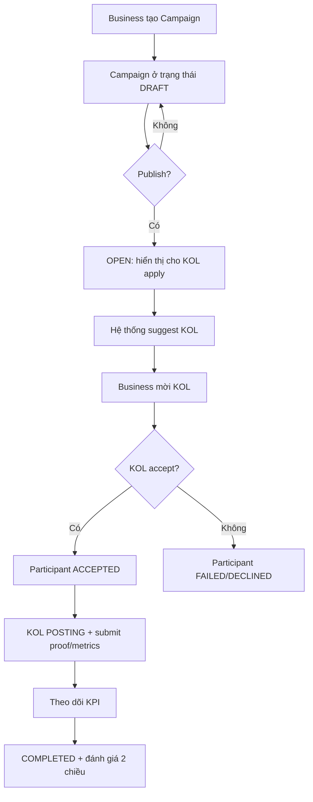

## Danh sách chức năng sản phẩm và đặc tả thực thi

### Tổng quan module và ưu tiên

Bảng dưới đây gom nhóm chức năng theo P0/P1/P2 để developer triển khai theo giai đoạn (mapping với MVP → Phase 2/3 trong tài liệu sản phẩm).

| Nhóm chức năng | Mục tiêu | Ưu tiên | Ghi chú trạng thái |
|---|---:|:---:|---|
| Auth & RBAC | Đăng ký/đăng nhập/role-based | P0 | Role: Admin/Business/KOL |
| Hồ sơ Business | Thông tin doanh nghiệp/agency | P0 | Public hiển thị tùy cài đặt |
| Hồ sơ KOL/KOC | Niche, follower, portfolio… | P0 | Public profile + dashboard chỉnh sửa |
| Campaign Management | Tạo campaign, KPI mục tiêu, yêu cầu KOL, mời KOL | P0 | Participant status: Pending/Accepted/Posting/Completed/Failed (tài liệu) |
| KOL Application | KOL tìm campaign mở và apply | P0 | Business approve/reject |
| KPI Tracking (Manual) | KOL submit metric, attach proof, tracking link | P0 | Verify bởi Business/Admin (*đề xuất*) |
| Rating cơ bản | Business ↔︎ KOL review sau campaign | P0 | 2 chiều như luồng nghiệp vụ |
| Transparency Dashboard | Ranking KOL/Business + 역사 campaign + rating | P0 | Public không cần account |
| Matching Engine (Rule-based) | Gợi ý KOL theo bộ lọc | P1 | Phase 2 |
| Matching Engine (Scoring) | Xếp hạng độ phù hợp | P1 | Phase 2 |
| KPI Tracking (Auto) | Social API ingestion, fraud detection signals | P2 | Phase 3/2 tùy nền tảng |
| Fraud detection, AI | Chống gian lận, gợi ý ROI | P2 | Phase 3 |

### Định nghĩa trạng thái và quy ước

**Quy ước trạng thái (đề xuất chuẩn hoá để code/DB/api thống nhất):**
- `CampaignStatus` (đề xuất): `DRAFT`, `OPEN`, `IN_PROGRESS`, `COMPLETED`, `CANCELLED`, `ARCHIVED`  
- `ParticipantStatus` (tối thiểu theo tài liệu): `PENDING`, `ACCEPTED`, `POSTING`, `COMPLETED`, `FAILED`  
- Trạng thái bổ sung thường cần cho nghiệp vụ (nhưng *không xác định* trong tài liệu): `DECLINED`, `REJECTED`, `WITHDRAWN`, `VERIFIED` (nếu có bước verify KPI)

**Ràng buộc dữ liệu chung**
- `budget` > 0; `startDate` < `endDate`; các KPI target không âm.  
- Các trường `createdAt`, `updatedAt` là RFC3339.  
- Mọi endpoint truy cập theo ID phải kiểm tra authorization theo object-level (chống BOLA/IDOR) theo khuyến nghị OWASP API Top 10.  

### Đặc tả chức năng theo luồng người dùng

**Đăng ký và phân quyền (P0)**  
Mục tiêu: tạo user theo role, đảm bảo Business và KOL có “profile” tương ứng.

Luồng:
1) Người dùng chọn role khi đăng ký.  
2) Hệ thống tạo `User` và profile rỗng tương ứng (`BusinessProfile` hoặc `KOLProfile`).  
3) Người dùng hoàn thiện hồ sơ qua onboarding.

Trạng thái:
- `User.status`: đề xuất `ACTIVE`, `SUSPENDED`, `DELETED` (soft delete). (*Nếu chưa có quyết định*: không xác định mức độ cần thiết.)

Ràng buộc:
- Email/phone unique (tuỳ định danh: *không xác định*).  
- Password lưu theo best practice (hash mạnh, salt) theo OWASP Password Storage Cheat Sheet.  

**KOL/KOC tạo & quản lý hồ sơ (P0)**  
Mục tiêu: KOL có niche, follower, nền tảng, CV/portfolio.

Luồng:
1) KOL vào trang `/app/kol/profile` cập nhật thông tin.  
2) Upload CV/portfolio (file) → liên kết lưu vào profile.  
3) Submit để public hiển thị (bật/tắt).

Trạng thái:
- `KOLProfile.visibility`: `PUBLIC`/`PRIVATE`.  
- `KOLProfile.verificationStatus`: *không xác định* (nếu muốn “Verified badge” cần quy trình).

Ràng buộc:
- `followerCount` nguyên không âm; `engagementRate` 0..1 (hoặc 0..100) thống nhất 1 loại.

**Business tạo chiến dịch (Campaign Management) (P0)**  
Mục tiêu: Business tạo campaign gồm: tên chiến dịch, sản phẩm, ngân sách, thời gian, KPI mục tiêu, yêu cầu KOL (niche, follower range, platform…). Đây là đúng với module Campaign Management trong tài liệu.  

Luồng (theo tài liệu, chi tiết hoá):

Trạng thái:
- `Campaign` chuyển từ DRAFT → OPEN khi Business publish; IN_PROGRESS khi có participant ACCEPTED và tới startDate (đề xuất).  
- `CampaignParticipant`: tối thiểu gồm Pending/Accepted/Posting/Completed/Failed theo tài liệu.  

Ràng buộc:
- Một campaign có thể attach nhiều KOL (đúng tài liệu).  
- Không cho sửa `kpiTargets` sau khi có participant ACCEPTED (*đề xuất để tránh tranh chấp; nếu không thoả: không xác định*).

**KOL tìm và apply campaign (P0)**  
Luồng:
1) KOL vào danh sách campaign OPEN.  
2) Filter theo niche/platform/budget/độ phù hợp (*độ phù hợp MVP là rule-based P1 nếu chưa làm matching*).  
3) Apply với message / đề xuất cost / cam kết. (*Các trường negotiation: không xác định trong tài liệu; MVP có thể chỉ “applyMessage” dạng text.*)  
4) Business duyệt (approve/reject).  
5) Nếu approve → Participant ACCEPTED.

**KPI Tracking (Manual + verify) (P0)**  
Mục tiêu: theo dõi ngày đăng bài, views, engagement, click, conversion, cost/efficiency; nguồn dữ liệu manual submission + verify và tracking link. (Đúng mô tả tài liệu.)  

Luồng MVP:
1) KOL nhập `postingUrl`, `postedAt`, metrics tự khai (views, likes, comments…), attach ảnh chụp màn hình/analytics export.  
2) Hệ thống đánh dấu “SUBMITTED”. (*Nếu thêm status: không xác định; có thể dùng `ParticipantStatus=POSTING` kèm `metricsStatus=SUBMITTED`*)  
3) Business (hoặc Admin) verify → “VERIFIED”.  
4) Hệ thống tính KPI attainment % so với target.

Ràng buộc:
- Mọi metric thay đổi phải lưu audit log (ai sửa, lúc nào) để minh bạch (đề xuất). OWASP API Top 10 nhấn mạnh tầm quan trọng inventory/versioning và cấu hình đúng, và việc API thường có nhiều endpoint nên cần quản trị rõ.  

**Reputation & Rating (P0)**  
Mục tiêu: xếp hạng KOL dựa trên completion rate, đạt KPI, đánh giá từ business, phản hồi người dùng, minh bạch quảng cáo; tạo score tổng, badge, ranking.  

Luồng review 2 chiều (sau khi participant COMPLETED):
1) Business chấm điểm KOL (1–5) + comment + “đạt KPI?” + “minh bạch?”  
2) KOL chấm điểm Business tương tự (uy tín thanh toán/brief rõ ràng… *không xác định* tiêu chí; MVP chỉ rating/comment)  
3) Người dùng phổ thông có thể để lại đánh giá KOL (theo tài liệu). Nhưng cần anti-abuse (rate limit / moderation).

Ràng buộc:
- Mỗi cặp (campaignId, fromUserId, toUserId) chỉ được tạo 1 review.  
- Review public phải lọc ngôn từ độc hại và có cơ chế report (không xác định cụ thể).

**Public Transparency Dashboard (P0)**  
Mục tiêu: xem bảng xếp hạng KOL/Business, xem trang KOL với lịch sử campaign và rating, xem “chứng chỉ xác minh minh bạch”.  

Chiến lược cập nhật:
- Ranking nên precompute theo ngày/giờ để tránh query nặng; hiển thị public dùng ISR (chi tiết ở phần Next.js).

