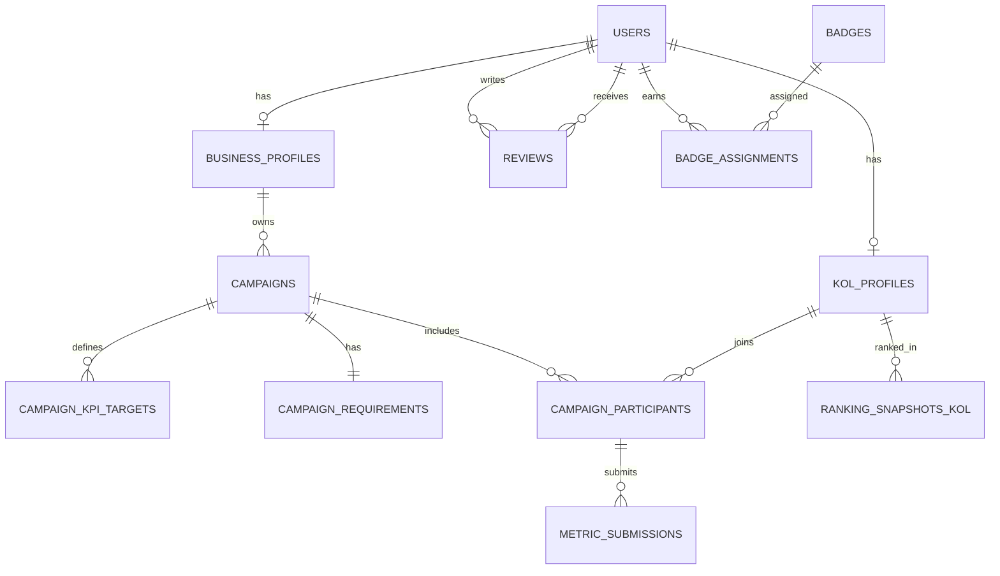

## Thiết kế database schema và ER diagram

### Lựa chọn DB và lý do

Khuyến nghị **PostgreSQL** cho MVP vì:
- Quan hệ dữ liệu rõ (campaign–participant–metrics–review), cần join/filter/sort theo thời gian/điểm số.
- Nhu cầu toàn vẹn dữ liệu khi cập nhật metrics/verify đồng thời; PostgreSQL mô tả cơ chế concurrency control để duy trì data integrity khi có nhiều phiên truy cập.  

Nếu chọn NoSQL (MongoDB), phù hợp khi dữ liệu “schema linh hoạt”, embedding document; MongoDB nhấn mạnh data modeling theo document và tính linh hoạt.  
(Trade-off chi tiết ở phần cuối.)

### Bảng schema (MVP) tóm tắt

| Table | Khóa chính | Cột chính (rút gọn) | Index khuyến nghị |
|---|---|---|---|
| `users` | `id` | `email`, `role`, `passwordHash`, `status`, `createdAt` | unique(`email`) |
| `kol_profiles` | `userId` (FK users) | `slug`, `displayName`, `niche`, `followerCount`, `engagementRate`, `ratingScore`, `visibility` | unique(`slug`), index(`ratingScore`) |
| `business_profiles` | `userId` (FK users) | `slug`, `name`, `industry`, `ratingScore` | unique(`slug`) |
| `campaigns` | `id` | `businessId`, `name`, `productName`, `budget`, `startDate`, `endDate`, `status` | index(`businessId`,`status`) |
| `campaign_kpi_targets` | `id` | `campaignId`, `metric`, `target`, `unit` | index(`campaignId`) |
| `campaign_requirements` | `campaignId` (PK/FK) | `platforms[]`, `niches[]`, `followerMin`, `followerMax` | GIN index (nếu dùng array) |
| `campaign_participants` | `id` | `campaignId`, `kolId`, `status`, `acceptedAt` | unique(`campaignId`,`kolId`) |
| `metric_submissions` | `id` | `participantId`, `metricsJson`, `postingUrl`, `postedAt`, `status`, `verifiedBy`, `verifiedAt` | index(`participantId`,`status`) |
| `reviews` | `id` | `campaignId`, `fromUserId`, `toUserId`, `rating`, `comment`, `createdAt` | unique(`campaignId`,`fromUserId`,`toUserId`) |
| `badges` | `code` | `name`, `description` | PK(`code`) |
| `badge_assignments` | `id` | `userId`, `badgeCode`, `assignedAt` | index(`userId`) |
| `ranking_snapshots_kol` | (`date`,`kolId`) | `score`, `rank` | index(`date`,`rank`) |

Ghi chú: `metricsJson` để MVP linh hoạt (views/likes/comments/clicks…), sau này có thể chuẩn hoá thành cột. (Nếu có chuẩn metric ngay từ đầu: *không xác định*.)

### ER diagram (mermaid)

