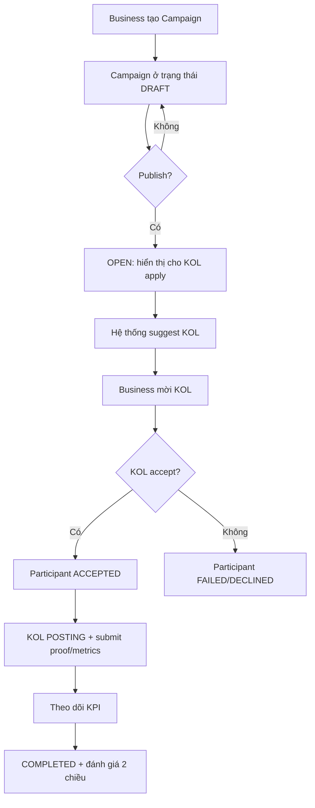
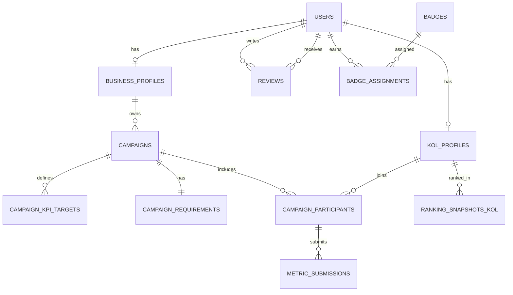

## Tóm tắt điều hành

Phạm vi và các module cốt lõi bám sát mô tả trong `product-vision.md`

Khuyến nghị kiến trúc triển khai:
- **Frontend**: Next.js App Router (Server Components mặc định), tận dụng **SSR/ISR** cho SEO và khả năng cập nhật bảng xếp hạng; dùng **dynamic rendering** cho dashboard cá nhân hoá. Next.js cung cấp cơ chế **fetch caching + revalidation** (ví dụ `next.revalidate`) để cân bằng “tươi dữ liệu” và hiệu năng. 
- **API**: Ưu tiên **REST v1** cho MVP (dễ triển khai/kiểm thử, phù hợp BFF). Chuẩn hoá lỗi theo **RFC 9457 Problem Details** để thống nhất error format. 
- **Auth**: Bearer token theo chuẩn OAuth bearer usage (RFC 6750) và định dạng token theo JWT (RFC 7519).  
- **Security baseline**: Bám theo OWASP API Security Top 10 (2023) cho kiểm soát BOLA/IDOR, inventory/versioning, anti-abuse; và OWASP cheat sheets cho password storage/logging.  
- **Database**: Ưu tiên **SQL (PostgreSQL)** vì quan hệ chặt (campaign–participant–metrics–review) và nhu cầu tính toán/đối soát. PostgreSQL có cơ chế kiểm soát đồng thời để đảm bảo toàn vẹn dữ liệu khi nhiều phiên truy cập.  

Các điểm “không xác định” (theo yêu cầu của bạn) được ghi rõ trong phần “Giả định và phạm vi” và từng mục liên quan: thanh toán/escrow, hợp đồng pháp lý, chat nội bộ, cơ chế dispute, tích hợp mạng xã hội cụ thể (TikTok/Meta/YouTube), chuẩn dữ liệu KPI theo từng nền tảng.

## Giả định và phạm vi

Các giả định tối thiểu để developer có thể triển khai (đều có thể thay đổi sau khi có quyết định sản phẩm; nếu không thay đổi, coi như tiêu chuẩn dự án):
- **Hình thức định danh**: ID dạng UUID cho các entity chính (User, Campaign, Participant…). (Nếu muốn ULID để sort theo thời gian: *không xác định*).  
- **Chuẩn thời gian**: Tất cả trường datetime dùng RFC 3339 (ISO8601 profile) để tránh nhập nhằng múi giờ.  
- **Vai trò hệ thống**: Admin/Business/KOL đúng như tài liệu sản phẩm; cơ chế phân quyền áp dụng trên từng endpoint theo role.  
- **MVP không bao gồm**: thanh toán, ký hợp đồng, escrow, in-app chat (đều *không xác định* trong tài liệu đầu vào).  
- **Tích hợp mạng xã hội**: MVP chỉ **manual submission + verify** và **tracking link (UTM/short link)**; tích hợp social API thuộc Phase 2 (đúng định hướng trong tài liệu).  
- **Ngôn ngữ**: mặc định `vi-VN`; i18n “sẵn sàng mở rộng” (không bắt buộc bật đa ngôn ngữ ngay). Next.js có guide i18n cho App Router.  

Phạm vi deliverable kỹ thuật trong báo cáo:
- Danh sách chức năng + luồng người dùng + trạng thái + ràng buộc + ưu tiên.
- Thiết kế Next.js (cấu trúc thư mục, routing, SSR/SSG/ISR theo trang, component tree, state, styling, a11y, i18n, performance, SEO).
- Thiết kế API REST + bản phác GraphQL (operation, schema mẫu, lỗi, auth, rate limit, pagination, versioning, webhook).
- Database schema + ERD bằng mermaid.
- Mẫu JSON, ví dụ request/response và code Next.js cho data fetching + form.
- Checklist setup/testing/CI/CD/security/logging/monitoring/migration.
- Kế hoạch triển khai và timeline ước tính, kèm trade-offs.

## Danh sách chức năng sản phẩm và đặc tả thực thi

### Tổng quan module và ưu tiên

Bảng dưới đây gom nhóm chức năng theo P0/P1/P2 để developer triển khai theo giai đoạn (mapping với MVP → Phase 2/3 trong tài liệu sản phẩm).

| Nhóm chức năng | Mục tiêu | Ưu tiên | Ghi chú trạng thái |
|---|---:|:---:|---|
| Auth & RBAC | Đăng ký/đăng nhập/role-based | P0 | Role: Admin/Business/KOL |
| Hồ sơ Business | Thông tin doanh nghiệp/agency | P0 | Public hiển thị tùy cài đặt |
| Hồ sơ KOL/KOC | Niche, follower, portfolio… | P0 | Public profile + dashboard chỉnh sửa |
| Campaign Management | Tạo campaign, KPI mục tiêu, yêu cầu KOL, mời KOL | P0 | Participant status: Pending/Accepted/Posting/Completed/Failed (tài liệu) |
| KOL Application | KOL tìm campaign mở và apply | P0 | Business approve/reject |
| KPI Tracking (Manual) | KOL submit metric, attach proof, tracking link | P0 | Verify bởi Business/Admin (*đề xuất*) |
| Rating cơ bản | Business ↔︎ KOL review sau campaign | P0 | 2 chiều như luồng nghiệp vụ |
| Transparency Dashboard | Ranking KOL/Business + 역사 campaign + rating | P0 | Public không cần account |
| Matching Engine (Rule-based) | Gợi ý KOL theo bộ lọc | P1 | Phase 2 |
| Matching Engine (Scoring) | Xếp hạng độ phù hợp | P1 | Phase 2 |
| KPI Tracking (Auto) | Social API ingestion, fraud detection signals | P2 | Phase 3/2 tùy nền tảng |
| Fraud detection, AI | Chống gian lận, gợi ý ROI | P2 | Phase 3 |

### Định nghĩa trạng thái và quy ước

**Quy ước trạng thái (đề xuất chuẩn hoá để code/DB/api thống nhất):**
- `CampaignStatus` (đề xuất): `DRAFT`, `OPEN`, `IN_PROGRESS`, `COMPLETED`, `CANCELLED`, `ARCHIVED`  
- `ParticipantStatus` (tối thiểu theo tài liệu): `PENDING`, `ACCEPTED`, `POSTING`, `COMPLETED`, `FAILED`  
- Trạng thái bổ sung thường cần cho nghiệp vụ (nhưng *không xác định* trong tài liệu): `DECLINED`, `REJECTED`, `WITHDRAWN`, `VERIFIED` (nếu có bước verify KPI)

**Ràng buộc dữ liệu chung**
- `budget` > 0; `startDate` < `endDate`; các KPI target không âm.  
- Các trường `createdAt`, `updatedAt` là RFC3339.  
- Mọi endpoint truy cập theo ID phải kiểm tra authorization theo object-level (chống BOLA/IDOR) theo khuyến nghị OWASP API Top 10.  

### Đặc tả chức năng theo luồng người dùng

**Đăng ký và phân quyền (P0)**  
Mục tiêu: tạo user theo role, đảm bảo Business và KOL có “profile” tương ứng.

Luồng:
1) Người dùng chọn role khi đăng ký.  
2) Hệ thống tạo `User` và profile rỗng tương ứng (`BusinessProfile` hoặc `KOLProfile`).  
3) Người dùng hoàn thiện hồ sơ qua onboarding.

Trạng thái:
- `User.status`: đề xuất `ACTIVE`, `SUSPENDED`, `DELETED` (soft delete). (*Nếu chưa có quyết định*: không xác định mức độ cần thiết.)

Ràng buộc:
- Email/phone unique (tuỳ định danh: *không xác định*).  
- Password lưu theo best practice (hash mạnh, salt) theo OWASP Password Storage Cheat Sheet.  

**KOL/KOC tạo & quản lý hồ sơ (P0)**  
Mục tiêu: KOL có niche, follower, nền tảng, CV/portfolio.

Luồng:
1) KOL vào trang `/app/kol/profile` cập nhật thông tin.  
2) Upload CV/portfolio (file) → liên kết lưu vào profile.  
3) Submit để public hiển thị (bật/tắt).

Trạng thái:
- `KOLProfile.visibility`: `PUBLIC`/`PRIVATE`.  
- `KOLProfile.verificationStatus`: *không xác định* (nếu muốn “Verified badge” cần quy trình).

Ràng buộc:
- `followerCount` nguyên không âm; `engagementRate` 0..1 (hoặc 0..100) thống nhất 1 loại.

**Business tạo chiến dịch (Campaign Management) (P0)**  
Mục tiêu: Business tạo campaign gồm: tên chiến dịch, sản phẩm, ngân sách, thời gian, KPI mục tiêu, yêu cầu KOL (niche, follower range, platform…). Đây là đúng với module Campaign Management trong tài liệu.  

Luồng (theo tài liệu, chi tiết hoá):


Trạng thái:
- `Campaign` chuyển từ DRAFT → OPEN khi Business publish; IN_PROGRESS khi có participant ACCEPTED và tới startDate (đề xuất).  
- `CampaignParticipant`: tối thiểu gồm Pending/Accepted/Posting/Completed/Failed theo tài liệu.  

Ràng buộc:
- Một campaign có thể attach nhiều KOL (đúng tài liệu).  
- Không cho sửa `kpiTargets` sau khi có participant ACCEPTED (*đề xuất để tránh tranh chấp; nếu không thoả: không xác định*).

**KOL tìm và apply campaign (P0)**  
Luồng:
1) KOL vào danh sách campaign OPEN.  
2) Filter theo niche/platform/budget/độ phù hợp (*độ phù hợp MVP là rule-based P1 nếu chưa làm matching*).  
3) Apply với message / đề xuất cost / cam kết. (*Các trường negotiation: không xác định trong tài liệu; MVP có thể chỉ “applyMessage” dạng text.*)  
4) Business duyệt (approve/reject).  
5) Nếu approve → Participant ACCEPTED.

**KPI Tracking (Manual + verify) (P0)**  
Mục tiêu: theo dõi ngày đăng bài, views, engagement, click, conversion, cost/efficiency; nguồn dữ liệu manual submission + verify và tracking link. (Đúng mô tả tài liệu.)  

Luồng MVP:
1) KOL nhập `postingUrl`, `postedAt`, metrics tự khai (views, likes, comments…), attach ảnh chụp màn hình/analytics export.  
2) Hệ thống đánh dấu “SUBMITTED”. (*Nếu thêm status: không xác định; có thể dùng `ParticipantStatus=POSTING` kèm `metricsStatus=SUBMITTED`*)  
3) Business (hoặc Admin) verify → “VERIFIED”.  
4) Hệ thống tính KPI attainment % so với target.

Ràng buộc:
- Mọi metric thay đổi phải lưu audit log (ai sửa, lúc nào) để minh bạch (đề xuất). OWASP API Top 10 nhấn mạnh tầm quan trọng inventory/versioning và cấu hình đúng, và việc API thường có nhiều endpoint nên cần quản trị rõ.  

**Reputation & Rating (P0)**  
Mục tiêu: xếp hạng KOL dựa trên completion rate, đạt KPI, đánh giá từ business, phản hồi người dùng, minh bạch quảng cáo; tạo score tổng, badge, ranking.  

Luồng review 2 chiều (sau khi participant COMPLETED):
1) Business chấm điểm KOL (1–5) + comment + “đạt KPI?” + “minh bạch?”  
2) KOL chấm điểm Business tương tự (uy tín thanh toán/brief rõ ràng… *không xác định* tiêu chí; MVP chỉ rating/comment)  
3) Người dùng phổ thông có thể để lại đánh giá KOL (theo tài liệu). Nhưng cần anti-abuse (rate limit / moderation).

Ràng buộc:
- Mỗi cặp (campaignId, fromUserId, toUserId) chỉ được tạo 1 review.  
- Review public phải lọc ngôn từ độc hại và có cơ chế report (không xác định cụ thể).

**Public Transparency Dashboard (P0)**  
Mục tiêu: xem bảng xếp hạng KOL/Business, xem trang KOL với lịch sử campaign và rating, xem “chứng chỉ xác minh minh bạch”.  

Chiến lược cập nhật:
- Ranking nên precompute theo ngày/giờ để tránh query nặng; hiển thị public dùng ISR (chi tiết ở phần Next.js).

## Thiết kế website Next.js cho giao diện

### Cấu trúc thư mục dự án và quy ước routing

Khuyến nghị dùng **App Router** (thư mục `app/`) và tách nhóm route bằng route groups để quản lý layout theo vùng public/app:

```
src/
  app/
    (public)/
      page.tsx                      // Home
      rankings/
        kols/page.tsx               // Public ranking KOL
        businesses/page.tsx         // Public ranking Business
      kol/[slug]/page.tsx           // Public KOL profile
      business/[slug]/page.tsx      // Public Business profile (optional)
      auth/
        login/page.tsx
        register/page.tsx
      legal/
        terms/page.tsx
        privacy/page.tsx
    (app)/
      layout.tsx                    // App shell (nav/sidebar)
      business/
        page.tsx                    // Business dashboard
        campaigns/
          page.tsx
          new/page.tsx
          [id]/page.tsx
          [id]/participants/page.tsx
      kol/
        page.tsx                    // KOL dashboard
        profile/page.tsx
        campaigns/
          page.tsx                  // invited/applied/active
          discover/page.tsx         // list OPEN campaigns
          [id]/page.tsx
      admin/                         // Admin console
        page.tsx
        users/page.tsx
        campaigns/page.tsx
        verifications/page.tsx
    api/
      v1/
        auth/route.ts
        campaigns/route.ts
        campaigns/[id]/route.ts
        ...
  lib/
    api-client.ts
    auth.ts
    db.ts
    validation/
  components/
    ui/
    forms/
    campaign/
    profile/
```

Lý do: App Router hỗ trợ **Route Handlers** ngay trong `app/` để làm API nếu cần (BFF), và Route Handlers là tương đương API routes ở Pages Router.  

### Quyết định SSR/SSG/ISR cho từng nhóm trang

Nguyên tắc:  
- Trang **public cần SEO** và dữ liệu thay đổi theo chu kỳ → ưu tiên **ISR/time-based revalidation**. Next.js hỗ trợ `next.revalidate` để đặt cache lifetime; hoặc segment-level config.  
- Trang **dashboard cá nhân hoá** → **dynamic rendering/SSR** (no-store) để luôn đúng theo user. Next.js phân biệt static vs dynamic rendering theo cách fetch và cache.  

Bảng quyết định:

| Trang | Rendering khuyến nghị | Lý do | Cấu hình gợi ý |
|---|---|---|---|
| `/` Home | SSG | Nội dung giới thiệu | mặc định |
| `/rankings/kols` | ISR | SEO + ranking update theo giờ/ngày | `fetch(..., { next: { revalidate: 300 } })` |
| `/rankings/businesses` | ISR | tương tự | revalidate 300–1800s |
| `/kol/[slug]` public | ISR + on-demand | tránh SSR nặng, nhưng update khi có review/metrics | revalidate 600s + webhook revalidate |
| `/auth/*` | SSG | ít dữ liệu | mặc định |
| `/app/business/*` | SSR/dynamic | dữ liệu theo Business | `cache: 'no-store'` hoặc segment dynamic |
| `/app/kol/*` | SSR/dynamic | dữ liệu theo KOL | tương tự |
| `/app/admin/*` | SSR/dynamic | nhạy cảm | no-store + strict auth |

### Component tree, state management và data flow

Khuyến nghị phân lớp:
- **Server Components** lo: fetch danh sách, render bảng ranking, preload dữ liệu (giảm JS client).  
- **Client Components** chỉ dùng cho: form, tương tác (filter UI, modal), charts.  

State management:
- **Server state**: ưu tiên fetch ở Server Components và truyền xuống.  
- **Client state**: dùng React state + URL search params cho filter/sort; nếu cần cache client (nhiều tương tác) có thể dùng TanStack Query/SWR (*thư viện cụ thể: không xác định; tuỳ team*).

Form handling:
- Dùng **Server Actions** cho mutation nếu muốn giảm boilerplate endpoint, và vì Server Actions tích hợp với caching/revalidation của Next.js.  
- Nếu hệ thống backend tách rời: dùng fetch tới REST API và xử lý optimistic UI tại client.

### Styling, accessibility, i18n, performance, SEO

Accessibility (bắt buộc trong quy định coding):
- Tuân thủ WCAG 2.2 (được công bố là W3C Recommendation).  
- Với component custom (tabs, combobox, modal), bám APG của WAI-ARIA để đảm bảo semantics và keyboard interaction.  
- Form error: luôn có `aria-describedby`, focus vào field lỗi đầu tiên, và danh sách lỗi tổng ở đầu form (đề xuất thực thi).

i18n:
- Nếu bật đa ngôn ngữ, dùng guide i18n cho App Router của Next.js.  
- Chuẩn URL: `/vi/...`, `/en/...` (prefix-based) để SEO tốt (đề xuất).

SEO:
- Dùng Metadata API (`metadata` hoặc `generateMetadata`) để đặt title/description/OG.  
- Dùng JSON-LD cho trang public (KOL profile, ranking) theo guide Next.js JSON-LD và theo hướng dẫn structured data của Google.  
- Nội dung SEO base: theo SEO Starter Guide của Google.  

Performance:
- Trang ranking nên server-render với ISR; client chỉ hydrate phần filter cần thiết. (Giảm JS, cải thiện TTFB/LCP).  
- Use streaming/loading UI (`loading.tsx`) và error boundary (`error.tsx`) theo conventions App Router (*cụ thể file: phụ thuộc quyết định UI; không xác định*).  
- Tránh N+1 fetch: gom API calls.

## Thiết kế API REST và phác thảo GraphQL

### Chuẩn chung cho API

**Base URL & versioning**
- REST: `/api/v1/...` (hoặc domain riêng `api.example.com/v1/...`: *không xác định*)  
- Versioning theo path để dễ inventory và giảm rủi ro “deprecated API” (phù hợp tinh thần OWASP API inventory management).  

**Auth**
- Header: `Authorization: Bearer <access_token>` theo RFC 6750.  
- Token format: JWT theo RFC 7519.  

**Error format**
- Dùng `application/problem+json` theo RFC 9457.  

**Rate limit**
- Nếu implement header theo draft IETF: `RateLimit-Policy` và `RateLimit` (hoặc các biến thể draft) để client biết quota.  
- Khi vượt giới hạn, trả HTTP 429 và có thể gửi `Retry-After` theo RFC 6585.  

**Pagination**
- Khuyến nghị cursor-based: `?limit=20&cursor=...` trả `nextCursor`.  
- Sorting: `?sort=-createdAt` hoặc `?sort=score:desc`.

**Timestamp**
- Tất cả datetime theo RFC 3339.  

### Bảng tóm tắt endpoints REST v1

| Nhóm | Method | Path | Auth | Mô tả |
|---|---|---|---|---|
| Auth | POST | `/api/v1/auth/register` | Public | Đăng ký + chọn role |
| Auth | POST | `/api/v1/auth/login` | Public | Đăng nhập |
| Auth | POST | `/api/v1/auth/refresh` | Public | Refresh token (*cơ chế lưu refresh: không xác định*) |
| Auth | POST | `/api/v1/auth/logout` | User | Thu hồi refresh/session |
| User | GET | `/api/v1/me` | User | Lấy profile hiện tại |
| Admin | GET | `/api/v1/admin/users` | Admin | List & filter user |
| KOL | GET | `/api/v1/kols` | User | List KOL (business dùng để tìm) |
| KOL | GET | `/api/v1/kols/{kolId}` | User/Public (tuỳ visibility) | Xem KOL detail |
| KOL | PATCH | `/api/v1/kols/{kolId}` | KOL/Admin | Update KOL profile |
| Business | GET | `/api/v1/businesses/{businessId}` | User/Public (tuỳ) | Detail business |
| Business | PATCH | `/api/v1/businesses/{businessId}` | Business/Admin | Update business profile |
| Campaign | POST | `/api/v1/campaigns` | Business | Tạo campaign |
| Campaign | GET | `/api/v1/campaigns` | User | List (filter theo status/role) |
| Campaign | GET | `/api/v1/campaigns/{id}` | User | Detail campaign |
| Campaign | PATCH | `/api/v1/campaigns/{id}` | Business/Admin | Update campaign (ràng buộc) |
| Campaign | POST | `/api/v1/campaigns/{id}/publish` | Business | Publish (DRAFT→OPEN) |
| Matching | GET | `/api/v1/campaigns/{id}/suggested-kols` | Business | Rule-based suggestions (P1) |
| Participant | POST | `/api/v1/campaigns/{id}/invites` | Business | Invite KOL vào campaign |
| Participant | POST | `/api/v1/campaigns/{id}/applications` | KOL | KOL apply campaign |
| Participant | POST | `/api/v1/participants/{pid}/accept` | KOL/Business | Accept invite/app (tuỳ flow) |
| Participant | PATCH | `/api/v1/participants/{pid}/status` | Business/KOL/Admin | Update status (Posting/Completed/Failed) |
| KPI | POST | `/api/v1/participants/{pid}/metrics` | KOL | Submit metrics + proof |
| KPI | POST | `/api/v1/participants/{pid}/metrics/verify` | Business/Admin | Verify metrics |
| Review | POST | `/api/v1/reviews` | User | Tạo review/rating |
| Review | GET | `/api/v1/reviews` | User/Public | List reviews theo toUser/campaign |
| Ranking | GET | `/api/v1/rankings/kols` | Public | Bảng xếp hạng KOL |
| Ranking | GET | `/api/v1/rankings/businesses` | Public | Bảng xếp hạng Business |
| Public | GET | `/api/v1/public/kols/{slug}` | Public | Public KOL page data |
| Public | GET | `/api/v1/public/businesses/{slug}` | Public | Public business page data (optional) |
| Webhook | POST | `/api/v1/webhooks/social/{provider}` | Provider | Nhận callback metric (P2) |

### Schema request/response mẫu và mã lỗi

**Quy ước response success**
```json
{
  "data": { },
  "meta": { "requestId": "..." }
}
```

**Quy ước lỗi (RFC 9457 Problem Details)**
Content-Type: `application/problem+json`
```json
{
  "type": "https://example.com/problems/validation-error",
  "title": "Validation error",
  "status": 422,
  "detail": "One or more fields are invalid.",
  "instance": "/api/v1/campaigns",
  "errors": [
    { "field": "budget", "reason": "must be > 0" }
  ],
  "requestId": "req_01H..."
}
```
Chuẩn Problem Details được định nghĩa để mang thông tin lỗi machine-readable cho HTTP APIs.  

**Endpoint: Tạo campaign (POST /api/v1/campaigns)**  
Request (MVP):
```json
{
  "name": "Ra mắt sản phẩm X",
  "productName": "Sản phẩm X",
  "budget": 50000000,
  "currency": "VND",
  "startDate": "2026-04-01T00:00:00+07:00",
  "endDate": "2026-04-30T23:59:59+07:00",
  "kpiTargets": [
    { "metric": "REACH", "target": 200000, "unit": "count" },
    { "metric": "CTR", "target": 0.015, "unit": "ratio" }
  ],
  "requirements": {
    "niches": ["beauty", "skincare"],
    "platforms": ["tiktok", "instagram"],
    "followerMin": 5000,
    "followerMax": 100000,
    "location": "VN"
  },
  "description": "Brief ngắn gọn...",
  "status": "DRAFT"
}
```

Response:
```json
{
  "data": {
    "id": "c1a3b4c5-1111-2222-3333-444455556666",
    "businessId": "b1...",
    "name": "Ra mắt sản phẩm X",
    "status": "DRAFT",
    "createdAt": "2026-03-15T10:20:30Z",
    "updatedAt": "2026-03-15T10:20:30Z"
  },
  "meta": { "requestId": "req_..." }
}
```

**Endpoint: Invite KOL (POST /api/v1/campaigns/{id}/invites)**  
Request:
```json
{
  "kolId": "k1...",
  "message": "Mời hợp tác chiến dịch...",
  "proposedFee": 3000000,
  "currency": "VND"
}
```

Response:
```json
{
  "data": {
    "participantId": "p1...",
    "campaignId": "c1...",
    "kolId": "k1...",
    "status": "PENDING"
  }
}
```

**Endpoint: Submit metrics (POST /api/v1/participants/{pid}/metrics)**  
Request:
```json
{
  "postedAt": "2026-04-10T12:00:00+07:00",
  "postingUrl": "https://tiktok.com/...",
  "metrics": {
    "views": 120000,
    "likes": 5600,
    "comments": 210,
    "shares": 85,
    "clicks": 1300,
    "conversions": 45
  },
  "proofFiles": [
    { "fileId": "f1...", "kind": "SCREENSHOT" }
  ]
}
```

### Phác thảo GraphQL

GraphQL hữu ích khi UI cần query nhiều entity liên quan (campaign → participants → metrics → reviews) trong 1 roundtrip và giảm overfetch/underfetch; đặc tả GraphQL được chuẩn hoá bởi GraphQL Foundation.  

**Schema khung (rút gọn)**
```graphql
type Query {
  me: User!
  publicKOL(slug: String!): KOLPublicView!
  rankingsKOLs(limit: Int!, cursor: String): KOLRankingConnection!
  campaign(id: ID!): Campaign!
  campaigns(filter: CampaignFilter, limit: Int!, cursor: String): CampaignConnection!
}

type Mutation {
  createCampaign(input: CreateCampaignInput!): Campaign!
  applyCampaign(campaignId: ID!, message: String): Participant!
  inviteKOL(campaignId: ID!, kolId: ID!, message: String): Participant!
  submitMetrics(participantId: ID!, input: MetricsInput!): MetricSubmission!
  createReview(input: CreateReviewInput!): Review!
}
```

**Ví dụ query ranking**
```graphql
query Rankings($limit: Int!, $cursor: String) {
  rankingsKOLs(limit: $limit, cursor: $cursor) {
    edges {
      node {
        kol { id slug displayName niche followerCount ratingScore }
        score
        badges { code name }
      }
    }
    pageInfo { endCursor hasNextPage }
  }
}
```

## Thiết kế database schema và ER diagram

### Lựa chọn DB và lý do

Khuyến nghị **PostgreSQL** cho MVP vì:
- Quan hệ dữ liệu rõ (campaign–participant–metrics–review), cần join/filter/sort theo thời gian/điểm số.
- Nhu cầu toàn vẹn dữ liệu khi cập nhật metrics/verify đồng thời; PostgreSQL mô tả cơ chế concurrency control để duy trì data integrity khi có nhiều phiên truy cập.  

Nếu chọn NoSQL (MongoDB), phù hợp khi dữ liệu “schema linh hoạt”, embedding document; MongoDB nhấn mạnh data modeling theo document và tính linh hoạt.  
(Trade-off chi tiết ở phần cuối.)

### Bảng schema (MVP) tóm tắt

| Table | Khóa chính | Cột chính (rút gọn) | Index khuyến nghị |
|---|---|---|---|
| `users` | `id` | `email`, `role`, `passwordHash`, `status`, `createdAt` | unique(`email`) |
| `kol_profiles` | `userId` (FK users) | `slug`, `displayName`, `niche`, `followerCount`, `engagementRate`, `ratingScore`, `visibility` | unique(`slug`), index(`ratingScore`) |
| `business_profiles` | `userId` (FK users) | `slug`, `name`, `industry`, `ratingScore` | unique(`slug`) |
| `campaigns` | `id` | `businessId`, `name`, `productName`, `budget`, `startDate`, `endDate`, `status` | index(`businessId`,`status`) |
| `campaign_kpi_targets` | `id` | `campaignId`, `metric`, `target`, `unit` | index(`campaignId`) |
| `campaign_requirements` | `campaignId` (PK/FK) | `platforms[]`, `niches[]`, `followerMin`, `followerMax` | GIN index (nếu dùng array) |
| `campaign_participants` | `id` | `campaignId`, `kolId`, `status`, `acceptedAt` | unique(`campaignId`,`kolId`) |
| `metric_submissions` | `id` | `participantId`, `metricsJson`, `postingUrl`, `postedAt`, `status`, `verifiedBy`, `verifiedAt` | index(`participantId`,`status`) |
| `reviews` | `id` | `campaignId`, `fromUserId`, `toUserId`, `rating`, `comment`, `createdAt` | unique(`campaignId`,`fromUserId`,`toUserId`) |
| `badges` | `code` | `name`, `description` | PK(`code`) |
| `badge_assignments` | `id` | `userId`, `badgeCode`, `assignedAt` | index(`userId`) |
| `ranking_snapshots_kol` | (`date`,`kolId`) | `score`, `rank` | index(`date`,`rank`) |

Ghi chú: `metricsJson` để MVP linh hoạt (views/likes/comments/clicks…), sau này có thể chuẩn hoá thành cột. (Nếu có chuẩn metric ngay từ đầu: *không xác định*.)

### ER diagram (mermaid)



## Mẫu JSON và mã ví dụ Next.js

### Ví dụ Next.js fetch data cho trang Ranking (ISR)

Next.js cho phép set revalidation theo thời gian bằng `fetch(..., { next: { revalidate: seconds } })`.  

`src/app/(public)/rankings/kols/page.tsx` (Server Component):
```ts
// src/app/(public)/rankings/kols/page.tsx
import type { Metadata } from "next";

export const metadata: Metadata = {
  title: "Bảng xếp hạng KOL",
  description: "Xếp hạng KOL/KOC theo hiệu suất và minh bạch."
};

type RankingItem = {
  kol: { id: string; slug: string; displayName: string; niche: string; followerCount: number; ratingScore: number };
  score: number;
  rank: number;
  badges: Array<{ code: string; name: string }>;
};

export default async function KOLRankingsPage() {
  const res = await fetch(`${process.env.API_BASE_URL}/api/v1/rankings/kols?limit=50`, {
    // ISR: refresh mỗi 5 phút
    next: { revalidate: 300 }
  });

  if (!res.ok) {
    // Có thể map problem+json sang UI error boundary
    throw new Error("Failed to load rankings");
  }

  const json = (await res.json()) as { data: RankingItem[] };
  const rows = json.data;

  return (
    <main>
      <h1>Bảng xếp hạng KOL</h1>
      <ol>
        {rows.map((r) => (
          <li key={r.kol.id}>
            <a href={`/kol/${r.kol.slug}`}>{r.rank}. {r.kol.displayName}</a>
            {" "}— Score: {r.score.toFixed(2)}
          </li>
        ))}
      </ol>
    </main>
  );
}
```

### Ví dụ form handling với Server Actions (tạo Campaign)

Server Actions có thể gọi từ `<form>` và tích hợp với cơ chế caching/revalidation của Next.js.  

`src/app/(app)/business/campaigns/new/actions.ts`:
```ts
"use server";

import { z } from "zod";

const CreateCampaignSchema = z.object({
  name: z.string().min(3),
  productName: z.string().min(1),
  budget: z.coerce.number().positive(),
  startDate: z.string().min(1),
  endDate: z.string().min(1),
});

export async function createCampaignAction(prevState: any, formData: FormData) {
  const parsed = CreateCampaignSchema.safeParse({
    name: formData.get("name"),
    productName: formData.get("productName"),
    budget: formData.get("budget"),
    startDate: formData.get("startDate"),
    endDate: formData.get("endDate"),
  });

  if (!parsed.success) {
    return { ok: false, fieldErrors: parsed.error.flatten().fieldErrors };
  }

  const res = await fetch(`${process.env.API_BASE_URL}/api/v1/campaigns`, {
    method: "POST",
    headers: {
      "Content-Type": "application/json",
      // TODO: lấy access token từ cookie/session (cơ chế auth cụ thể: không xác định)
      "Authorization": `Bearer ${process.env.DEV_ACCESS_TOKEN ?? ""}`,
    },
    body: JSON.stringify({
      ...parsed.data,
      currency: "VND",
      status: "DRAFT",
      kpiTargets: [],
      requirements: {},
      description: ""
    })
  });

  if (!res.ok) {
    const problem = await res.json().catch(() => null);
    return { ok: false, problem };
  }

  const json = await res.json();
  return { ok: true, campaignId: json.data.id };
}
```

`src/app/(app)/business/campaigns/new/page.tsx`:
```tsx
import { createCampaignAction } from "./actions";

export default function NewCampaignPage() {
  return (
    <main>
      <h1>Tạo chiến dịch</h1>
      <form action={createCampaignAction}>
        <label>
          Tên chiến dịch
          <input name="name" required minLength={3} />
        </label>

        <label>
          Sản phẩm
          <input name="productName" required />
        </label>

        <label>
          Ngân sách (VND)
          <input name="budget" type="number" required min={1} />
        </label>

        <label>
          Ngày bắt đầu
          <input name="startDate" type="date" required />
        </label>

        <label>
          Ngày kết thúc
          <input name="endDate" type="date" required />
        </label>

        <button type="submit">Lưu</button>
      </form>
    </main>
  );
}
```

### Metadata và structured data (SEO)

Dùng `generateMetadata`/`metadata` để tăng SEO và chia sẻ mạng xã hội.  
Nếu cần JSON-LD: theo guide JSON-LD của Next.js.  

## Checklist cho developer và kế hoạch triển khai

### Checklist kỹ thuật

**Setup & env**
- Node.js version: *không xác định* (chốt theo LTS hiện tại của team).  
- `.env` phân tách biến public (`NEXT_PUBLIC_*`) và private; lưu ý biến `NEXT_PUBLIC_*` sẽ bị inline vào JS client và sau build không đổi theo runtime env.  
- Quy ước `API_BASE_URL`, `DATABASE_URL`, `JWT_SECRET`, `WEBHOOK_SECRET`, `S3_BUCKET` (*nếu có upload; provider: không xác định*).

**Testing**
- Unit test: validation, scoring logic, permission checks (BOLA/IDOR).  
- Integration test: campaign lifecycle, participant transitions, metrics submission/verify, review uniqueness.  
- E2E: luồng Business tạo campaign → invite/apply → KOL submit KPI → complete → rating.

**CI/CD**
- Pipeline tối thiểu: `lint` → `typecheck` → `test` → `build` → `deploy`.  
- Nếu self-host: ưu tiên Next.js `output: "standalone"` để đóng gói runtime tối giản cho Docker.  

**Security**
- Kiểm soát object-level authorization trên mọi endpoint có `{id}` theo OWASP API Top 10.  
- Password hashing theo OWASP Password Storage Cheat Sheet.  
- Logging các sự kiện security (login fail, permission denied, rate limited) theo OWASP Logging Cheat Sheet.  
- Không tạo header “X-…” mới cho tiêu chuẩn nội bộ; IETF khuyến cáo deprecate “X-” prefix cho tham số/field mới.  
- Rate limiting trả 429 + `Retry-After` theo RFC 6585.  

**Logging & monitoring**
- Chuẩn hoá `requestId` trace xuyên suốt FE↔BE.  
- Instrumentation/observability: Next.js có hướng dẫn instrumentation (kết hợp OpenTelemetry nếu cần).  

**Migration**
- Dùng migration tool của ORM (*Prisma hay tương đương: không xác định*). Nếu dùng Prisma, quan hệ model được mô tả rõ trong docs về relations.  

### Kế hoạch triển khai và timeline ước tính

> Timeline mang tính ước lượng cho 1 squad nhỏ (PM + 1 FE + 1 BE + 1 QA part-time + DevOps hỗ trợ). Nếu team khác quy mô, thời gian thay đổi tương ứng (*không xác định năng lực/nguồn lực thực tế*).

| Phase | Thời lượng | Deliverables | Owner chính |
|---|---:|---|---|
| Foundation | 1–2 tuần | Repo setup, CI/CD, auth skeleton, DB migrations, base UI kit | Tech Lead/FE/BE |
| MVP P0 | 4–6 tuần | Role onboarding, KOL/Business profiles, Campaign CRUD+publish, apply/invite/accept, manual KPI submit, basic reviews, public rankings (ISR) | FE+BE |
| Phase 2 P1 | 4–6 tuần | Matching rule-based + scoring v1, KPI verify workflow hoàn chỉnh, badge + ranking snapshot | BE (alg) + FE |
| Phase 3 P2 | 6–10 tuần | Social API ingestion, fraud detection signals, AI recommendation, ROI analytics | BE/DS/DE (*không xác định*) |

### Bảng trade-offs bắt buộc

**SSR vs SSG vs CSR**

| Tiêu chí | SSR | SSG | CSR |
|---|---|---|---|
| SEO | Tốt (HTML sẵn) | Rất tốt | Kém hơn nếu render muộn |
| Fresh data | Tốt (per-request) | Kém (build-time) | Tốt nhưng phụ thuộc client |
| Chi phí server | Cao hơn | Thấp | Trung bình |
| Phù hợp trang | Dashboard, dữ liệu cá nhân | Landing, nội dung ít đổi | UI tương tác nặng, ít SEO |

Next.js hỗ trợ static/dynamic rendering và ISR để lấy ưu điểm của cả hai.  

**REST vs GraphQL**

| Tiêu chí | REST | GraphQL |
|---|---|---|
| MVP speed | Nhanh, rõ endpoint | Cần schema + resolver |
| Cache CDN | Dễ cache GET | Khó hơn (thường POST) |
| Overfetch/Underfetch | Có thể xảy ra | Giảm đáng kể |
| Observability | Dễ theo route | Cần theo operation name |

GraphQL được chuẩn hoá theo GraphQL spec.  

**SQL vs NoSQL**

| Tiêu chí | SQL (PostgreSQL) | NoSQL (MongoDB) |
|---|---|---|
| Quan hệ & join | Mạnh | Thiết kế embedding/reference tuỳ use case |
| Consistency | Giao dịch mạnh, phù hợp đối soát | Linh hoạt, nhưng consistency/transaction tuỳ mô hình |
| Schema evolution | Cần migration | Linh hoạt hơn |
| Use case phù hợp | Campaign/participant/review/ranking | Metrics raw đa dạng, event log |

PostgreSQL mô tả cơ chế concurrency control nhằm đảm bảo toàn vẹn khi nhiều session thao tác; MongoDB nhấn mạnh data modeling theo document linh hoạt.